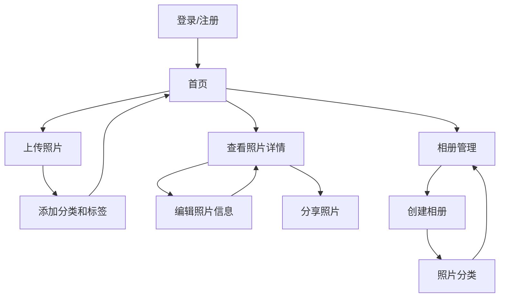

## 1. 产品概述
照片收藏系统是一个用于用户上传、管理和分享个人照片的平台，解决用户照片分散存储和管理不便的问题。
- 主要面向个人用户，提供照片的分类、标签、搜索和分享功能
- 目标是成为用户首选的个人照片管理工具，提升照片管理效率和体验

## 2. 核心功能

### 2.1 用户角色
| 角色 | 注册方式 | 核心权限 |
|------|---------------------|------------------|
| 普通用户 | 邮箱注册 | 上传、管理、分享个人照片 |
| 管理员 | 系统分配 | 管理所有用户和照片 |

### 2.2 功能模块
1. **首页**：照片展示、导航栏、搜索功能
2. **上传页**：照片上传、分类设置、标签添加
3. **详情页**：照片查看、信息编辑、分享功能
4. **相册页**：相册管理、照片分类

### 2.3 页面详情
| 页面名称 | 模块名称 | 功能描述 |
|-----------|-------------|---------------------|
| 首页 | 照片展示 | 以网格或瀑布流形式展示用户照片，支持排序和筛选 |
| 首页 | 导航栏 | 包含logo、用户信息、功能入口 |
| 首页 | 搜索功能 | 支持按关键词、标签、日期等搜索照片 |
| 上传页 | 照片上传 | 支持批量上传、拖拽上传，显示上传进度 |
| 上传页 | 分类设置 | 为照片选择或创建相册分类 |
| 上传页 | 标签添加 | 为照片添加自定义标签，便于后续搜索 |
| 详情页 | 照片查看 | 大图查看模式，支持缩放和全屏 |
| 详情页 | 信息编辑 | 编辑照片标题、描述、标签等信息 |
| 详情页 | 分享功能 | 生成分享链接或直接分享到社交媒体 |
| 相册页 | 相册管理 | 创建、编辑、删除相册，设置相册封面 |
| 相册页 | 照片分类 | 将照片移动到不同相册，调整相册顺序 |

## 3. 核心流程
用户使用流程：
1. 用户注册/登录系统
2. 上传照片并添加相关信息（分类、标签等）
3. 浏览和管理已上传的照片
4. 创建相册并对照片进行分类
5. 查看照片详情并进行编辑
6. 分享照片给其他用户

## 4. 用户界面设计
### 4.1 设计风格
- 主色调：#3B82F6（蓝色）、#F9FAFB（浅灰色背景）
- 辅助色：#10B981（绿色）、#F59E0B（橙色）
- 按钮风格：圆角设计，有轻微阴影效果
- 字体：Inter，标题18-24px，正文14-16px
- 布局风格：卡片式布局，顶部导航栏，响应式设计
- 图标风格：简约线性图标，使用lucide-react库

### 4.2 页面设计概览
| 页面名称 | 模块名称 | UI元素 |
|-----------|-------------|-------------|
| 首页 | 照片展示 | 网格布局，每张照片有悬停效果，显示基本信息 |
| 首页 | 导航栏 | 固定顶部，包含logo、搜索框、用户头像和功能菜单 |
| 上传页 | 照片上传 | 拖拽区域，上传进度条，支持多文件选择 |
| 详情页 | 照片查看 | 居中大图展示，左右切换按钮，底部信息栏 |
| 相册页 | 相册管理 | 相册卡片网格，每个相册显示封面和照片数量 |

### 4.3 响应式设计
- 桌面优先设计，适配移动端
- 桌面端：网格布局，多列显示
- 平板端：适当调整列数和间距
- 移动端：单列布局，优化触摸交互

### 4.4 3D场景指导（不适用）
- 本产品不涉及3D场景