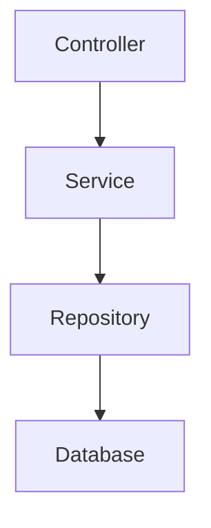
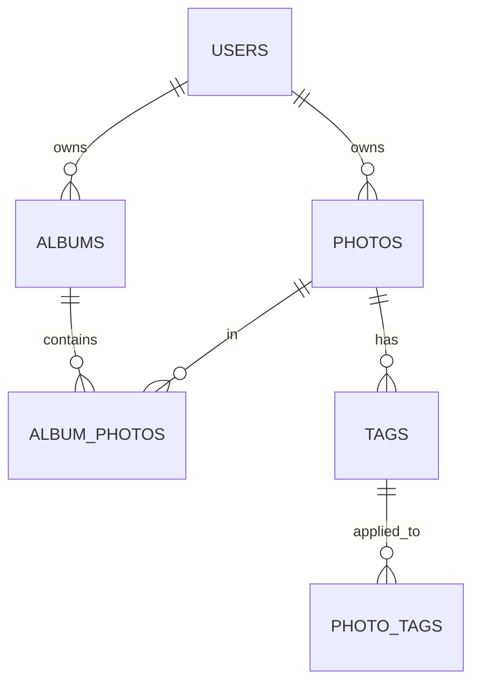

## 1. 架构设计
```mermaid
graph TD
    A[前端] --> B[Supabase Auth]
    A --> C[Supabase Storage]
    A --> D[Supabase Database]
    A --> E[后端API] (可选)
    E --> D
    E --> C
```

## 2. 技术描述
- 前端：React@18 + tailwindcss@3 + vite
- 初始化工具：vite-init
- 后端：Supabase（主要）/ Express@4（可选）
- 数据库：Supabase（PostgreSQL）
- 认证：Supabase Auth
- 存储：Supabase Storage

## 3. 路由定义
| 路由 | 用途 |
|-------|---------|
| / | 首页，照片展示 |
| /upload | 照片上传页面 |
| /photo/:id | 照片详情页面 |
| /albums | 相册管理页面 |
| /album/:id | 相册详情页面 |
| /login | 登录页面 |
| /register | 注册页面 |

## 4. API定义（可选）
如果使用Express后端，API定义如下：

### 4.1 照片相关API
- GET /api/photos - 获取照片列表
- POST /api/photos - 上传照片
- GET /api/photos/:id - 获取照片详情
- PUT /api/photos/:id - 更新照片信息
- DELETE /api/photos/:id - 删除照片

### 4.2 相册相关API
- GET /api/albums - 获取相册列表
- POST /api/albums - 创建相册
- GET /api/albums/:id - 获取相册详情
- PUT /api/albums/:id - 更新相册信息
- DELETE /api/albums/:id - 删除相册
- POST /api/albums/:id/photos - 添加照片到相册
- DELETE /api/albums/:id/photos/:photoId - 从相册移除照片

## 5. 服务器架构图（可选）
如果使用Express后端：


## 6. 数据模型
### 6.1 数据模型定义


### 6.2 数据定义语言
```sql
-- 用户表（由Supabase Auth自动创建）

-- 照片表
CREATE TABLE photos (
    id UUID PRIMARY KEY DEFAULT gen_random_uuid(),
    user_id UUID REFERENCES auth.users(id),
    filename TEXT NOT NULL,
    file_path TEXT NOT NULL,
    title TEXT,
    description TEXT,
    uploaded_at TIMESTAMP DEFAULT now(),
    tags TEXT[]
);

-- 相册表
CREATE TABLE albums (
    id UUID PRIMARY KEY DEFAULT gen_random_uuid(),
    user_id UUID REFERENCES auth.users(id),
    name TEXT NOT NULL,
    description TEXT,
    cover_photo_id UUID REFERENCES photos(id),
    created_at TIMESTAMP DEFAULT now()
);

-- 相册-照片关联表
CREATE TABLE album_photos (
    id UUID PRIMARY KEY DEFAULT gen_random_uuid(),
    album_id UUID REFERENCES albums(id),
    photo_id UUID REFERENCES photos(id),
    added_at TIMESTAMP DEFAULT now()
);

-- 标签表
CREATE TABLE tags (
    id UUID PRIMARY KEY DEFAULT gen_random_uuid(),
    name TEXT NOT NULL UNIQUE
);

-- 照片-标签关联表
CREATE TABLE photo_tags (
    id UUID PRIMARY KEY DEFAULT gen_random_uuid(),
    photo_id UUID REFERENCES photos(id),
    tag_id UUID REFERENCES tags(id)
);

-- 权限设置
GRANT SELECT ON photos TO anon;
GRANT ALL PRIVILEGES ON photos TO authenticated;

GRANT SELECT ON albums TO anon;
GRANT ALL PRIVILEGES ON albums TO authenticated;

GRANT SELECT ON album_photos TO anon;
GRANT ALL PRIVILEGES ON album_photos TO authenticated;

GRANT SELECT ON tags TO anon;
GRANT ALL PRIVILEGES ON tags TO authenticated;

GRANT SELECT ON photo_tags TO anon;
GRANT ALL PRIVILEGES ON photo_tags TO authenticated;

-- RLS策略
ALTER TABLE photos ENABLE ROW LEVEL SECURITY;
CREATE POLICY "Users can view their own photos" ON photos FOR SELECT USING (user_id = auth.uid());
CREATE POLICY "Users can insert their own photos" ON photos FOR INSERT WITH CHECK (user_id = auth.uid());
CREATE POLICY "Users can update their own photos" ON photos FOR UPDATE USING (user_id = auth.uid());
CREATE POLICY "Users can delete their own photos" ON photos FOR DELETE USING (user_id = auth.uid());

ALTER TABLE albums ENABLE ROW LEVEL SECURITY;
CREATE POLICY "Users can view their own albums" ON albums FOR SELECT USING (user_id = auth.uid());
CREATE POLICY "Users can insert their own albums" ON albums FOR INSERT WITH CHECK (user_id = auth.uid());
CREATE POLICY "Users can update their own albums" ON albums FOR UPDATE USING (user_id = auth.uid());
CREATE POLICY "Users can delete their own albums" ON albums FOR DELETE USING (user_id = auth.uid());
```