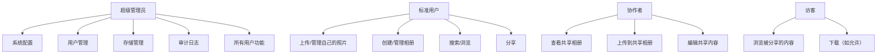
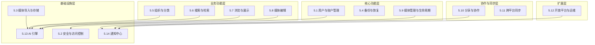
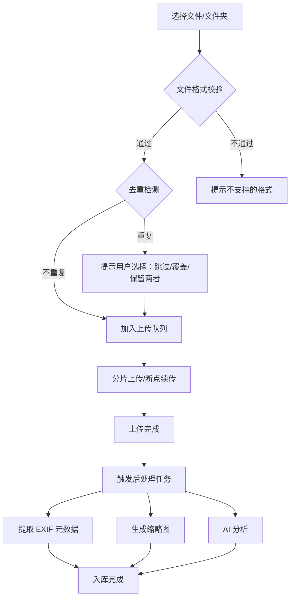
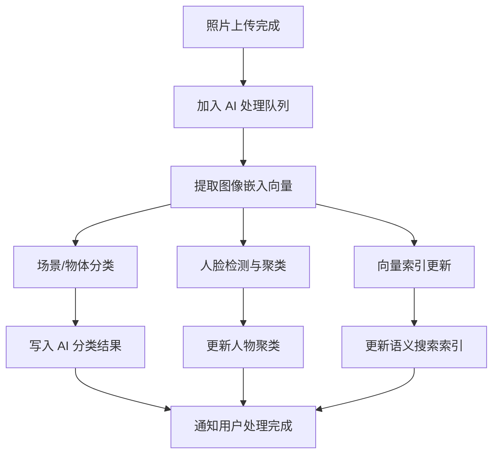
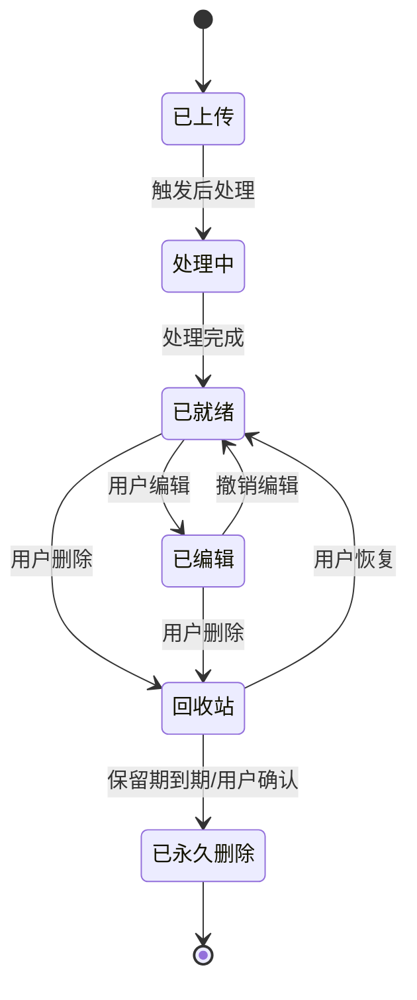
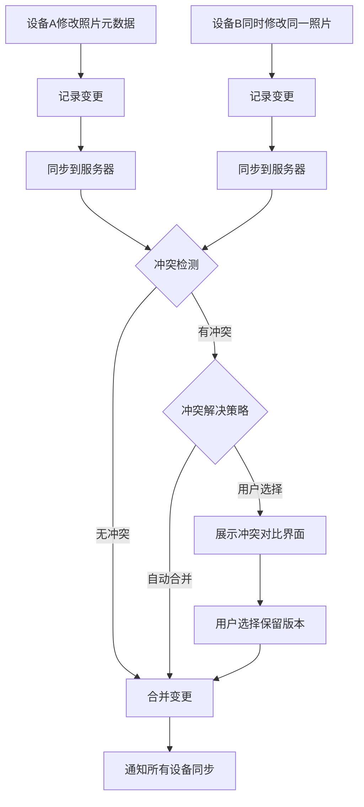
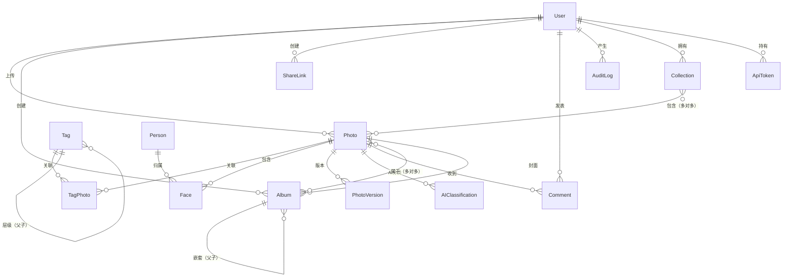

# 照片收藏系统 — 产品需求文档（PRD）

| 项目信息 | 内容 |
|---------|------|
| **文档标题** | 照片收藏系统 — 产品需求文档（PRD） |
| **文档版本** | v1.0 |
| **文档状态** | 草稿 |
| **编写日期** | 2026-04-09 |
| **部署模式** | 仅本地/私有化 |
| **技术约束** | 技术无关 |

---

## 目录

- [第 1 章：执行摘要](#第-1-章执行摘要)
- [第 2 章：项目背景与市场分析](#第-2-章项目背景与市场分析)
- [第 3 章：目标用户与角色定义](#第-3-章目标用户与角色定义)
- [第 4 章：系统架构约束与部署模式](#第-4-章系统架构约束与部署模式)
- [第 5 章：功能需求详细说明](#第-5-章功能需求详细说明)
  - [5.1 用户账户与权限管理](#51-用户账户与权限管理)
  - [5.2 照片上传与存储](#52-照片上传与存储)
  - [5.3 组织与分类](#53-组织与分类)
  - [5.4 搜索与检索](#54-搜索与检索)
  - [5.5 浏览与展示](#55-浏览与展示)
  - [5.6 编辑与管理](#56-编辑与管理)
  - [5.7 分享与协作](#57-分享与协作)
  - [5.8 安全与隐私](#58-安全与隐私)
  - [5.9 跨平台同步](#59-跨平台同步)
  - [5.10 扩展与集成](#510-扩展与集成)
- [第 6 章：非功能需求](#第-6-章非功能需求)
- [第 7 章：数据模型设计](#第-7-章数据模型设计)
- [第 8 章：用户界面与交互设计要求](#第-8-章用户界面与交互设计要求)
- [第 9 章：部署与运维要求](#第-9-章部署与运维要求)
- [第 10 章：安全设计详细说明](#第-10-章安全设计详细说明)
- [第 11 章：测试策略与验收标准](#第-11-章测试策略与验收标准)
- [第 12 章：项目里程碑与优先级规划](#第-12-章项目里程碑与优先级规划)
- [第 13 章：风险评估与缓解措施](#第-13-章风险评估与缓解措施)
- [第 14 章：术语表与附录](#第-14-章术语表与附录)

---

## 第 1 章：执行摘要

### 1.1 产品定位

照片收藏系统是一款面向个人用户、家庭用户及小型团队的**私有化照片收藏与数字资产管理系统**。系统以数据完全自主可控为核心原则，提供照片的上传、存储、智能分类、高效搜索、浏览展示、编辑管理、分享协作等全生命周期管理能力。

### 1.2 问题陈述

| 痛点 | 描述 |
|------|------|
| **隐私安全** | 云端照片服务存在数据泄露风险，用户对个人隐私照片的存储安全性日益担忧 |
| **碎片化存储** | 照片分散在手机、电脑、硬盘、各类云服务中，缺乏统一管理 |
| **检索困难** | 随着照片数量增长（数万至数十万张），传统文件夹方式难以高效检索 |
| **管理低效** | 缺乏批量管理、智能分类能力，整理照片耗时耗力 |
| **厂商锁定** | 云端服务可能停运或变更政策，用户面临数据迁移困难 |

### 1.3 产品愿景

打造一款**功能全面、隐私优先、AI 驱动**的本地照片管理解决方案，让用户在完全掌控自己数据的前提下，享受智能化的照片管理体验。

### 1.4 核心价值主张

- **数据自主可控**：所有数据存储在用户本地/私有服务器，无需依赖外部云服务
- **AI 智能分类**：本地运行的 AI 模型自动识别人物、场景、物体，实现智能分类与语义搜索
- **多端无缝同步**：Web 端 + 移动端 App，多设备实时同步，支持离线访问
- **插件化可扩展**：开放的插件系统与 API 接口，支持功能扩展与第三方集成
- **非破坏性编辑**：所有编辑操作保留原始文件，支持版本回溯

### 1.5 目标平台

| 平台 | 说明 |
|------|------|
| **Web 端** | 响应式设计，支持桌面/平板/手机浏览器，PWA 支持 |
| **移动端** | iOS 和 Android 原生或跨平台应用 |
| **桌面端**（可选） | 桌面客户端，用于本地照片批量导入与管理 |

### 1.6 文档范围

**包含：**
- 照片的全生命周期管理（上传、存储、分类、搜索、浏览、编辑、分享）
- 用户与权限管理
- AI 智能分类与搜索
- 跨平台同步
- API 接口与插件系统
- 本地/私有化部署方案

**不包含：**
- 视频深度编辑功能（仅支持视频文件存储与预览）
- 专业级修图功能（定位为基础编辑，非替代专业修图软件）
- 公有云 SaaS 服务运营
- 硬件设备设计与制造

---

## 第 2 章：项目背景与市场分析

### 2.1 市场现状分析

#### 2.1.1 云端照片服务

| 服务 | 优势 | 劣势 |
|------|------|------|
| Google Photos | AI 搜索强大、免费额度高 | 隐私顾虑、需联网、免费额度缩减 |
| iCloud Photos | Apple 生态无缝集成 | 仅限 Apple 设备、存储费用高、隐私顾虑 |
| OneDrive | 与 Office 集成、存储空间大 | 照片管理功能薄弱、隐私顾虑 |

**共同问题**：数据存储在第三方服务器，用户无法完全掌控；存在服务变更/停运风险。

#### 2.1.2 开源自托管方案

| 项目 | 特点 | 局限 |
|------|------|------|
| Immich | 功能全面、移动端体验好、活跃开发 | AI 能力有限、部署较复杂 |
| PhotoPrism | AI 分类强、界面美观 | 资源占用较高、部分功能需付费 |
| LibrePhotos | 完全开源、AI 驱动 | 开发活跃度下降、性能优化不足 |
| Ente | 端到端加密、移动端好 | 功能相对简单、社区较小 |

#### 2.1.3 商业方案

| 服务 | 特点 | 局限 |
|------|------|------|
| Adobe Lightroom | 专业编辑、云同步 | 订阅费用高、需联网、隐私顾虑 |
| Capture One | 专业调色 | 价格昂贵、学习曲线陡峭 |

### 2.2 竞品功能对比矩阵

| 功能 | Google Photos | Immich | PhotoPrism | **本系统（目标）** |
|------|:---:|:---:|:---:|:---:|
| 本地/私有化部署 | ❌ | ✅ | ✅ | ✅ |
| AI 人脸识别 | ✅ | ✅ | ✅ | ✅ |
| AI 场景/物体识别 | ✅ | ⚠️ | ✅ | ✅ |
| 自然语言语义搜索 | ✅ | ❌ | ⚠️ | ✅ |
| 以图搜图 | ✅ | ❌ | ⚠️ | ✅ |
| 地图视图 | ✅ | ✅ | ✅ | ✅ |
| 非破坏性编辑 | ⚠️ | ❌ | ❌ | ✅ |
| 协作相册 | ✅ | ⚠️ | ❌ | ✅ |
| 插件系统 | ❌ | ❌ | ❌ | ✅ |
| 完全离线运行 | ❌ | ✅ | ✅ | ✅ |
| 端到端加密 | ❌ | ❌ | ❌ | ✅（可选） |
| 开放 API | ⚠️ | ✅ | ✅ | ✅ |

> ✅ 完全支持 | ⚠️ 部分支持 | ❌ 不支持

### 2.3 差异化竞争优势

1. **完全本地化 AI**：所有 AI 模型在本地运行，无需调用外部 API，保障隐私
2. **插件化架构**：开放的插件系统，用户可按需扩展功能
3. **非破坏性编辑**：专业级的非破坏性编辑工作流
4. **语义搜索**：基于向量嵌入的自然语言图像搜索
5. **端到端加密（可选）**：最高级别的数据安全保障

### 2.4 用户痛点调研总结

| 排名 | 痛点 | 严重程度 | 目标解决方案 |
|------|------|:--------:|-------------|
| 1 | 担心云端隐私泄露 | 高 | 本地/私有化部署 + 端到端加密 |
| 2 | 照片太多找不到 | 高 | AI 智能分类 + 语义搜索 + 多维度筛选 |
| 3 | 整理照片太耗时 | 高 | 自动分类 + 批量操作 + 智能相册 |
| 4 | 多设备照片不统一 | 中 | 多端同步 + 自动备份 |
| 5 | 分享照片不方便 | 中 | 分享链接 + 协作相册 |
| 6 | 担心误删照片 | 中 | 回收站 + 版本控制 + 自动备份 |

---

## 第 3 章：目标用户与角色定义

### 3.1 用户画像（Persona）

#### Persona 1：摄影爱好者 — "张明"

| 属性 | 描述 |
|------|------|
| **年龄** | 28-40 岁 |
| **职业** | 业余摄影爱好者 / 设计师 |
| **照片量** | 5 万-20 万张 |
| **设备** | 微单相机 + 手机 + 家用 NAS |
| **核心需求** | RAW 格式支持、专业元数据管理、高效检索、非破坏性编辑 |
| **痛点** | 照片量大难以管理、需要按相机/镜头/参数筛选、文件夹层级太深 |
| **使用场景** | 拍摄后批量导入 → 按项目分类 → 挑选精修 → 整理到相册 → 分享作品 |

#### Persona 2：家庭用户 — "李芳"

| 属性 | 描述 |
|------|------|
| **年龄** | 30-45 岁 |
| **职业** | 全职妈妈 / 职场白领 |
| **照片量** | 1 万-5 万张 |
| **设备** | 手机（iPhone/Android）+ 家庭电脑 |
| **核心需求** | 手机自动备份、按时间/人物浏览、家庭成员共享、回忆回顾 |
| **痛点** | 手机存储空间不足、想给家人看照片但不想用公开平台、孩子成长记录分散 |
| **使用场景** | 手机拍照自动备份 → 按人物/时间浏览 → 创建家庭相册 → 分享给远方的亲人 |

#### Persona 3：小型工作室 — "王强"

| 属性 | 描述 |
|------|------|
| **年龄** | 25-50 岁 |
| **职业** | 摄影工作室 / 设计团队负责人 |
| **照片量** | 10 万-50 万张 |
| **设备** | 多台相机 + 工作站 + 局域网服务器 |
| **核心需求** | 多人协作、权限管理、品牌资产管理、高效批量处理 |
| **痛点** | 团队成员照片分散、客户照片需要权限隔离、需要按项目/客户管理 |
| **使用场景** | 团队成员上传拍摄照片 → 按项目分类 → 内部评审 → 精选后分享给客户 |

### 3.2 系统角色定义



| 角色 | 描述 | 权限范围 |
|------|------|---------|
| **超级管理员** | 系统最高权限管理者 | 系统配置、用户管理、存储管理、审计日志、所有用户功能 |
| **标准用户** | 普通注册用户 | 上传/管理自己的照片、创建相册、搜索浏览、分享 |
| **协作者** | 被邀请参与协作的用户 | 查看共享相册、上传到共享相册、编辑共享内容 |
| **访客** | 通过分享链接访问的用户 | 仅浏览被分享的内容，权限由分享设置决定 |

### 3.3 核心使用场景

#### 场景 1：手机照片自动备份

> 作为家庭用户李芳，我希望打开手机 App 后照片能自动备份到家庭服务器，以便释放手机存储空间且不担心照片丢失。

**前置条件**：用户已安装移动端 App 并登录
**主要流程**：
1. App 检测到新照片
2. 在 Wi-Fi 环境下自动上传到服务器
3. 上传完成后在手机上显示"已备份"标记
4. 用户可选择清理手机上已备份的原始照片

#### 场景 2：按人物浏览照片

> 作为家庭用户李芳，我希望系统能自动识别照片中的人物并按人物分类，以便快速找到某个人的所有照片。

**前置条件**：系统已完成 AI 人脸识别扫描
**主要流程**：
1. 用户进入"人物"视图
2. 系统展示已识别的人物聚类
3. 用户为人物命名（如"爸爸""妈妈""宝宝"）
4. 点击人物头像即可浏览该人物的所有照片

#### 场景 3：智能搜索

> 作为摄影爱好者张明，我希望用自然语言搜索照片（如"去年夏天在海边的日落"），以便快速找到特定场景的照片而无需手动翻找。

**前置条件**：系统已完成 AI 向量化索引
**主要流程**：
1. 用户在搜索框输入自然语言描述
2. 系统解析查询意图
3. 返回语义匹配的照片列表
4. 用户可进一步通过筛选条件缩小范围

#### 场景 4：团队协作管理

> 作为工作室负责人王强，我希望创建项目相册并邀请团队成员上传照片，以便集中管理项目素材。

**前置条件**：用户具有创建相册的权限
**主要流程**：
1. 创建项目相册并设置权限
2. 邀请团队成员加入协作
3. 团队成员上传各自拍摄的照片
4. 负责人筛选精选照片并分享给客户

---

## 第 4 章：系统架构约束与部署模式

### 4.1 部署模式定义

#### 4.1.1 纯本地部署（单机模式）

- **适用场景**：个人用户在家庭 NAS 或个人电脑上运行
- **特点**：单机运行，无网络依赖，所有服务在同一台机器上
- **最低配置**：4 核 CPU / 8GB 内存 / 500GB 存储

#### 4.1.2 私有化部署（局域网/内网服务器）

- **适用场景**：家庭或小型企业在局域网服务器上运行
- **特点**：局域网内多设备访问，支持反向代理暴露到公网（可选）
- **推荐配置**：8 核 CPU / 16GB 内存 / 2TB+ 存储

### 4.2 架构原则

```
┌─────────────────────────────────────────────────┐
│                  客户端层                         │
│  ┌──────────┐  ┌──────────┐  ┌──────────┐       │
│  │ Web 浏览器 │  │ iOS App  │  │Android App│      │
│  │  (PWA)   │  │          │  │          │       │
│  └────┬─────┘  └────┬─────┘  └────┬─────┘       │
│       └──────────────┼──────────────┘             │
│                      │ HTTPS                     │
├──────────────────────┼───────────────────────────┤
│                      ▼                           │
│              反向代理 / API 网关                    │
│                      │                           │
├──────────────────────┼───────────────────────────┤
│                  服务层                            │
│  ┌──────────┐  ┌──────────┐  ┌──────────┐       │
│  │ 用户服务  │  │ 照片服务  │  │ 搜索服务  │      │
│  └────┬─────┘  └────┬─────┘  └────┬─────┘       │
│  ┌──────────┐  ┌──────────┐  ┌──────────┐       │
│  │ AI 服务   │  │ 分享服务  │  │ 插件服务  │      │
│  └────┬─────┘  └────┬─────┘  └────┬─────┘       │
│       └──────────────┼──────────────┘             │
├──────────────────────┼───────────────────────────┤
│                  数据层                            │
│  ┌──────────┐  ┌──────────┐  ┌──────────┐       │
│  │关系型数据库│  │ 对象存储  │  │ 缓存层   │      │
│  │(元数据)   │  │(原始文件) │  │(查询/缩略图)│     │
│  └──────────┘  └──────────┘  └──────────┘       │
│  ┌──────────┐  ┌──────────┐                     │
│  │ 消息队列  │  │ 向量数据库 │                     │
│  │(异步任务) │  │(AI 索引)  │                     │
│  └──────────┘  └──────────┘                     │
└─────────────────────────────────────────────────┘
```

| 原则 | 说明 |
|------|------|
| **无外部网络依赖** | 核心功能完全离线可用，AI 模型本地运行 |
| **容器化交付** | 支持容器化一键部署，降低部署复杂度 |
| **存储与计算分离** | 原始文件、缩略图、数据库、AI 模型独立存储路径 |
| **模块化服务** | 各功能模块松耦合，可独立扩展 |
| **异步任务处理** | 上传后处理（缩略图生成、AI 分析、元数据提取）通过消息队列异步执行 |

### 4.3 技术约束（技术无关层面）

| 组件 | 约束要求 |
|------|---------|
| **数据库** | 关系型数据库，用于存储用户、权限、照片元数据、相册等结构化数据 |
| **对象存储/文件系统** | 原始照片文件存储，支持挂载外部存储/NAS |
| **缓存层** | 元数据查询缓存、缩略图缓存，提升响应速度 |
| **消息队列** | 异步任务处理（上传后处理、AI 分析、缩略图生成） |
| **向量数据库** | AI 图像嵌入向量存储，用于语义搜索 |
| **AI 推理引擎** | 本地模型运行环境，支持 CPU 和可选 GPU 加速 |

### 4.4 硬件配置要求

| 配置项 | 最低配置 | 推荐配置 | 高性能配置 |
|--------|---------|---------|-----------|
| **CPU** | 4 核 | 8 核 | 16+ 核 |
| **内存** | 8 GB | 16 GB | 32+ GB |
| **存储** | 500 GB HDD | 2 TB SSD | 4+ TB NVMe SSD |
| **GPU**（可选） | 无 | 入门级独立显卡 | 中高端独立显卡 |
| **网络** | 百兆局域网 | 千兆局域网 | 万兆局域网 |

> **说明**：GPU 为可选配置，用于加速 AI 模型推理。无 GPU 时使用 CPU 推理，功能完整但处理速度较慢。

### 4.5 网络拓扑要求

```
┌──────────────┐     局域网      ┌──────────────┐
│   客户端设备   │ ◄──────────► │   应用服务器   │
│ (PC/手机/平板) │              │  (Docker 宿主机)│
└──────────────┘              └──────┬───────┘
                                     │
                              ┌──────┴───────┐
                              │   存储设备    │
                              │ (NAS/外挂硬盘) │
                              └──────────────┘
```

| 网络要求 | 说明 |
|---------|------|
| **内部通信** | 局域网内客户端与服务器通信，建议千兆网络 |
| **TLS 加密** | 内网可使用自签证书，公网暴露需正规证书 |
| **端口暴露** | 最小化端口暴露，仅开放必要的服务端口 |
| **DNS** | 局域网内可使用本地 DNS 或 hosts 文件解析 |

---

## 第 5 章：功能需求详细说明

> **说明**：本章已拆分为 14 个独立功能模块文档，存储在 `照片收藏系统PRD/` 目录下。以下为各模块的概要和链接。

### 模块总览

| 编号 | 模块名称 | 优先级 | 独立文档 | 来源 |
|------|---------|:------:|---------|------|
| 5.1 | 用户与账户管理 | P0 | [📄 文档](照片收藏系统PRD/5.1-用户与账户管理.md) | 原 5.1 精简 |
| 5.2 | 安全与访问控制 | P0-P2 | [📄 文档](照片收藏系统PRD/5.2-安全与访问控制.md) | 原 5.8 + 5.1 RBAC 合并 |
| 5.3 | 媒体导入与存储 | P0 | [📄 文档](照片收藏系统PRD/5.3-媒体导入与存储.md) | 原 5.2 增强 |
| 5.4 | 备份与恢复 | P1 | [📄 文档](照片收藏系统PRD/5.4-备份与恢复.md) | 原 5.2 备份 + 5.10 S3 合并 |
| 5.5 | 组织与分类 | P0 | [📄 文档](照片收藏系统PRD/5.5-组织与分类.md) | 原 5.3 增强 |
| 5.6 | 搜索与检索 | P0 | [📄 文档](照片收藏系统PRD/5.6-搜索与检索.md) | 原 5.4 保持 |
| 5.7 | 浏览与展示 | P0 | [📄 文档](照片收藏系统PRD/5.7-浏览与展示.md) | 原 5.5 增强 |
| 5.8 | 媒体编辑 | P1 | [📄 文档](照片收藏系统PRD/5.8-媒体编辑.md) | 原 5.6 编辑部分增强 |
| 5.9 | 媒体管理与生命周期 | P1 | [📄 文档](照片收藏系统PRD/5.9-媒体管理与生命周期.md) | 原 5.6 回收站 + 新增 |
| 5.10 | 分享与协作 | P1 | [📄 文档](照片收藏系统PRD/5.10-分享与协作.md) | 原 5.7 增强 |
| 5.11 | 跨平台同步与离线 | P0-P1 | [📄 文档](照片收藏系统PRD/5.11-跨平台同步与离线.md) | 原 5.9 保持 |
| 5.12 | 开放平台与运维 | P2-P3 | [📄 文档](照片收藏系统PRD/5.12-开放平台与运维.md) | 原 5.10 扩展 |
| 5.13 | AI 引擎与智能服务 | P1 | [📄 文档](照片收藏系统PRD/5.13-AI引擎与智能服务.md) | **新增** |
| 5.14 | 通知与消息中心 | P2 | [📄 文档](照片收藏系统PRD/5.14-通知与消息中心.md) | **新增** |

### 模块依赖关系



### 调整说明（v1.0 → v1.1）

相比初始版本，功能模块从 10 个调整为 14 个，主要变更：

1. **消除冗余**：RBAC 权限统一归入 5.2 安全模块；备份功能统一归入 5.4 备份与恢复模块
2. **新增 AI 引擎**（5.13）：将分散的 AI 能力抽取为独立基础设施层
3. **新增通知中心**（5.14）：统一管理所有通知和消息
4. **增强功能**：5.3 新增视频管理/存储模板；5.5 新增堆叠/归档/文件夹视图；5.7 新增 Live Photos/360°/回忆；5.8 新增 AI 编辑；5.10 新增评论/活动流/点赞；5.12 新增外部库挂载/监控/i18n

---

> 以下为原始 v1.0 版本的功能需求详细内容（已由上述 14 个独立文档替代）。

### 5.1 用户账户与权限管理

**优先级**：P0（核心基础功能）

#### 5.1.1 用户注册与登录

| 功能 | 描述 | 优先级 |
|------|------|:------:|
| 用户名+密码注册 | 支持用户名和密码注册新账户 | P0 |
| 邮箱邀请注册 | 管理员发送邀请码/邀请链接，用户通过邀请完成注册 | P0 |
| 密码登录 | 使用用户名/邮箱 + 密码登录 | P0 |
| 记住登录状态 | 可选"记住我"功能，延长登录有效期 | P0 |
| 修改密码 | 登录后可修改密码，需验证旧密码 | P0 |
| 密码重置 | 通过管理员重置或安全问题验证重置 | P1 |

**密码策略要求：**
- 最小长度 8 位
- 必须包含大小写字母和数字
- 支持配置密码过期策略（管理员可设置）
- 密码使用强哈希算法存储（如 bcrypt/Argon2）

**用户故事：**

> 作为新用户，我希望通过管理员发送的邀请链接注册账户，以便加入系统的使用。

> 作为已注册用户，我希望在登录时选择"记住我"，以便下次打开时无需重新输入密码。

**验收标准：**

```gherkin
Scenario: 用户通过邀请链接注册
  Given 管理员已生成一个有效的邀请链接
  When 用户点击邀请链接并填写用户名和密码完成注册
  Then 用户账户创建成功并自动登录
  And 该邀请链接标记为已使用

Scenario: 密码强度验证
  Given 用户在注册页面输入密码
  When 密码长度小于8位或不包含大小写字母和数字
  Then 系统显示密码强度不足的提示
  And 不允许提交注册表单
```

#### 5.1.2 多角色权限体系（RBAC）

| 功能 | 描述 | 优先级 |
|------|------|:------:|
| 角色管理 | 管理员可创建、编辑、删除自定义角色 | P1 |
| 权限矩阵 | 基于角色的权限控制，支持细粒度权限配置 | P0 |
| 资源级权限 | 相册级、照片级的访问权限控制 | P1 |
| 权限继承 | 用户可同时拥有多个角色，权限取并集 | P1 |

**权限矩阵：**

| 权限项 | 超级管理员 | 标准用户 | 协作者 | 访客 |
|--------|:--------:|:------:|:-----:|:---:|
| 系统配置 | ✅ | ❌ | ❌ | ❌ |
| 用户管理 | ✅ | ❌ | ❌ | ❌ |
| 存储管理 | ✅ | ❌ | ❌ | ❌ |
| 查看审计日志 | ✅ | ❌ | ❌ | ❌ |
| 上传照片 | ✅ | ✅ | ⚠️（共享相册） | ❌ |
| 管理自己的照片 | ✅ | ✅ | ⚠️（共享内容） | ❌ |
| 创建相册 | ✅ | ✅ | ❌ | ❌ |
| 浏览所有公开内容 | ✅ | ✅ | ✅ | ✅（仅分享内容） |
| 分享照片 | ✅ | ✅ | ❌ | ❌ |
| 使用 API | ✅ | ✅ | ❌ | ❌ |
| 管理插件 | ✅ | ❌ | ❌ | ❌ |

**用户故事：**

> 作为超级管理员，我希望为不同用户分配不同角色，以便控制各成员的访问权限。

> 作为标准用户，我希望创建私有相册并设置访问权限，以便只让特定的人查看。

**验收标准：**

```gherkin
Scenario: 角色权限控制
  Given 系统中存在"标准用户"角色
  When 标准用户尝试访问系统配置页面
  Then 系统拒绝访问并显示"权限不足"提示

Scenario: 资源级权限控制
  Given 用户A创建了一个私有相册
  And 用户A未授权用户B访问该相册
  When 用户B尝试浏览该相册
  Then 系统不显示该相册
```

#### 5.1.3 隐私设置

| 功能 | 描述 | 优先级 |
|------|------|:------:|
| 个人资料可见性 | 控制其他用户是否可查看个人资料 | P1 |
| 默认上传可见范围 | 设置新上传照片的默认可见性（私有/公开） | P1 |
| 活动状态显示 | 控制是否显示在线状态 | P2 |
| 个人资料编辑 | 修改头像、昵称、个人简介 | P0 |

#### 5.1.4 用户管理（管理员功能）

| 功能 | 描述 | 优先级 |
|------|------|:------:|
| 用户列表 | 查看所有注册用户列表 | P0 |
| 创建用户 | 管理员直接创建用户账户 | P0 |
| 禁用/启用用户 | 临时禁用或重新启用用户账户 | P0 |
| 删除用户 | 删除用户及其关联数据 | P1 |
| 存储配额设置 | 为每个用户设置存储空间上限 | P1 |
| 批量用户导入 | 通过 CSV 文件批量导入用户 | P2 |

---

### 5.2 照片上传与存储

**优先级**：P0（核心基础功能）

#### 5.2.1 批量上传

| 功能 | 描述 | 优先级 |
|------|------|:------:|
| 拖拽上传 | 将文件/文件夹拖拽到上传区域 | P0 |
| 文件夹上传 | 选择整个文件夹进行上传 | P0 |
| 多文件选择 | 文件选择器支持多选 | P0 |
| 上传进度显示 | 总体进度 + 单文件进度条 | P0 |
| 断点续传 | 网络中断后可从断点继续上传 | P0 |
| 失败重试 | 上传失败的文件自动/手动重试 | P0 |
| 上传队列管理 | 暂停、恢复、取消上传任务 | P1 |
| 后台上传 | 移动端支持后台上传，不影响其他操作 | P0 |
| 去重检测 | 上传时自动检测重复文件 | P1 |

**上传流程：**



**用户故事：**

> 作为摄影爱好者，我希望拖拽一个包含 500 张 RAW 格式照片的文件夹进行批量上传，并看到上传进度和预计剩余时间。

> 作为家庭用户，我希望手机上的新照片能在 Wi-Fi 环境下自动备份到服务器，以便释放手机存储空间。

**验收标准：**

```gherkin
Scenario: 批量文件夹上传
  Given 用户在 Web 端上传页面
  When 用户拖拽一个包含100张JPEG照片的文件夹到上传区域
  Then 系统显示上传队列和总体进度
  And 逐个上传文件并显示单文件进度
  And 上传完成后自动触发元数据提取和缩略图生成

Scenario: 断点续传
  Given 用户正在上传一个大文件
  When 网络连接中断后恢复
  Then 系统自动从断点处继续上传
  And 不需要重新上传已传输的部分
```

#### 5.2.2 多格式支持

| 类别 | 支持格式 | 优先级 |
|------|---------|:------:|
| **常见图片** | JPEG、PNG、WebP、BMP、GIF | P0 |
| **高清格式** | TIFF、HEIC/HEIF | P0 |
| **RAW 格式** | CR2（Canon）、NEF（Nikon）、ARW（Sony）、DNG、ORF（Olympus）、RAF（Fujifilm） | P1 |
| **视频**（可选） | MP4、MOV、MKV、WebM、AVI | P2 |
| **文档**（可选） | PDF（仅预览） | P3 |

#### 5.2.3 EXIF/IPTC/XMP 元数据提取

| 功能 | 描述 | 优先级 |
|------|------|:------:|
| EXIF 自动提取 | 拍摄日期时间、相机/镜头型号、光圈、快门、ISO、GPS 坐标、尺寸、分辨率、方向 | P0 |
| IPTC 字段解析 | 标题、描述、关键词、版权信息 | P1 |
| XMP 侧车文件 | 解析外部 XMP 元数据文件 | P1 |
| 元数据写入 | 修改照片的 EXIF/IPTC 元数据并写回文件 | P2 |
| GPS 反向地理编码 | 将 GPS 坐标转换为可读的地名（离线地理编码库） | P1 |
| 元数据批量编辑 | 批量修改多张照片的元数据 | P2 |

#### 5.2.4 本地存储策略

| 功能 | 描述 | 优先级 |
|------|------|:------:|
| 存储路径可配置 | 支持自定义原始文件存储路径 | P0 |
| 外部存储挂载 | 支持挂载 NAS、外接硬盘等外部存储 | P0 |
| 文件组织策略 | 按日期/按用户/扁平/自定义规则组织文件 | P1 |
| 存储配额管理 | 监控和限制用户/系统的存储使用量 | P1 |
| 存储健康检测 | 定期校验文件完整性（哈希比对） | P2 |
| 存储空间预警 | 存储空间不足时发出告警 | P1 |

#### 5.2.5 备份与版本控制

| 功能 | 描述 | 优先级 |
|------|------|:------:|
| 原始文件保留 | 编辑后始终保留原始文件 | P0 |
| 版本历史 | 记录文件的编辑历史，支持版本回溯 | P1 |
| 自动备份 | 支持配置自动备份计划（数据库 + 文件） | P1 |
| 增量备份 | 仅备份变更部分，减少备份时间和空间 | P2 |
| 备份验证 | 备份完成后自动验证备份完整性 | P2 |
| 一键恢复 | 从备份快速恢复数据 | P1 |

#### 5.2.6 文件去重

| 功能 | 描述 | 优先级 |
|------|------|:------:|
| 精确去重 | 基于文件哈希（SHA-256）检测完全相同的文件 | P1 |
| 相似照片检测 | 基于感知哈希检测相似/连拍照片 | P2 |
| 去重策略 | 自动跳过 / 提示用户 / 保留两者（可配置） | P1 |
| 去重扫描 | 手动触发全库去重扫描 | P2 |

---

### 5.3 组织与分类

**优先级**：P0（核心功能）

#### 5.3.1 相册管理

| 功能 | 描述 | 优先级 |
|------|------|:------:|
| 创建相册 | 创建新相册，设置名称、描述、封面 | P0 |
| 编辑相册 | 修改相册名称、描述、封面、排序 | P0 |
| 删除相册 | 删除相册（照片可选择保留或一并删除） | P0 |
| 相册类型 | 普通相册、智能相册（基于规则自动填充）、共享相册 | P1 |
| 相册嵌套 | 支持文件夹层级结构（最多 3 层） | P1 |
| 相册排序 | 按日期、名称、手动拖拽排序 | P0 |
| 相册封面 | 自动选取或手动设置相册封面 | P0 |
| 照片添加/移除 | 向相册添加或移除照片（不删除原始文件） | P0 |

**智能相册规则类型：**
- 按日期范围（如"2025 年所有照片"）
- 按标签组合（如"包含'风景'和'日落'标签"）
- 按人物（如"包含'宝宝'的所有照片"）
- 按地点（如"在'北京'拍摄的照片"）
- 按设备（如"用 iPhone 拍摄的照片"）
- 按评分（如"4 星及以上"）
- 组合规则（AND/OR/NOT 逻辑）

**用户故事：**

> 作为标准用户，我希望创建一个智能相册，自动收集所有包含"宝宝"标签的照片，以便随时查看孩子的成长记录。

> 作为摄影爱好者，我希望按项目创建嵌套相册结构（如"2025/婚礼/预拍"），以便有序管理拍摄项目。

**验收标准：**

```gherkin
Scenario: 智能相册自动填充
  Given 用户创建了一个智能相册，规则为"标签包含'风景'"
  When 系统中有新照片被标记了"风景"标签
  Then 该照片自动出现在智能相册中

Scenario: 相册嵌套
  Given 用户已创建相册"2025"
  When 用户在"2025"下创建子相册"旅行"
  Then 相册列表中显示层级结构
  And 用户可进入子相册查看内容
```

#### 5.3.2 标签系统

| 功能 | 描述 | 优先级 |
|------|------|:------:|
| 标签 CRUD | 创建、编辑、删除标签 | P0 |
| 层级标签 | 支持标签树/标签组（如"地点 > 中国 > 北京"） | P2 |
| 批量打标签 | 选中多张照片批量添加/移除标签 | P0 |
| 标签云展示 | 以标签云形式展示所有标签及其使用频率 | P1 |
| 标签合并 | 将多个相似标签合并为一个 | P1 |
| 标签颜色/图标 | 为标签设置自定义颜色或图标 | P2 |
| 标签使用统计 | 显示各标签的使用次数和趋势 | P2 |
| AI 自动标签 | AI 自动识别并建议标签 | P1 |

#### 5.3.3 AI 智能分类

| 功能 | 描述 | 优先级 |
|------|------|:------:|
| 场景分类 | 自动识别场景类型（风景、人像、美食、建筑、动物、夜景等） | P1 |
| 物体识别 | 自动识别照片中的物体（车辆、动物、食物、植物等） | P1 |
| 人脸检测 | 自动检测照片中的人脸区域 | P1 |
| 人脸聚类 | 将相似人脸自动聚类分组 | P1 |
| 人物命名 | 为人脸聚类命名，后续自动识别 | P1 |
| 按人物浏览 | 通过人物列表浏览该人物的所有照片 | P1 |
| 地点归类 | 基于 GPS 数据自动按地点分类 | P1 |
| 时间线分组 | 按日/周/月/年自动分组 | P0 |
| AI 置信度展示 | 显示 AI 分类的置信度，支持用户纠正 | P2 |
| AI 重新扫描 | 管理员可触发全库 AI 重新扫描 | P2 |

**AI 处理流程：**



**用户故事：**

> 作为家庭用户，我希望系统能自动识别照片中的人物并让我为他们命名，以便后续能快速按人物查找照片。

> 作为摄影爱好者，我希望系统能自动按拍摄地点归类照片，以便回顾在不同地方的拍摄经历。

**验收标准：**

```gherkin
Scenario: AI 人脸识别与命名
  Given 系统已完成人脸检测扫描
  When 系统检测到一组相似的人脸聚类
  Then 在"人物"视图中展示该聚类
  And 用户可为该聚类命名
  And 命名后系统自动将新照片中匹配的人脸归入该人物

Scenario: AI 场景分类
  Given 一张包含海滩和日落的照片被上传
  When AI 处理完成
  Then 该照片被自动标记"海滩"和"日落"标签
  And 在场景分类中出现对应分类
```

#### 5.3.4 收藏夹

| 功能 | 描述 | 优先级 |
|------|------|:------:|
| 收藏/取消收藏 | 一键收藏或取消收藏照片 | P0 |
| 收藏快速访问 | 在导航栏提供收藏夹快速入口 | P0 |
| 智能收藏 | 基于规则自动收藏（如"AI 评分高于阈值"） | P2 |
| 收藏夹分类 | 支持创建多个收藏夹/精选集 | P1 |

---

### 5.4 搜索与检索

**优先级**：P0（核心功能）

#### 5.4.1 关键词搜索

| 功能 | 描述 | 优先级 |
|------|------|:------:|
| 全文搜索 | 搜索照片名称、描述、标签、EXIF 信息 | P0 |
| 搜索建议 | 输入时实时显示搜索建议/自动补全 | P1 |
| 搜索历史 | 记录并展示搜索历史 | P2 |
| 搜索结果排序 | 按相关度、日期、名称排序 | P0 |
| 搜索范围选择 | 可限定搜索范围（全部/当前相册/特定人物） | P1 |

#### 5.4.2 高级筛选

| 筛选维度 | 描述 | 优先级 |
|---------|------|:------:|
| 时间范围 | 日期选择器、相对时间（今天/本周/本月/本年/自定义） | P0 |
| 相机/镜头 | 按相机型号、镜头型号筛选 | P1 |
| 文件类型 | 按文件格式筛选（JPEG/RAW/视频等） | P1 |
| 尺寸范围 | 按分辨率/文件大小范围筛选 | P2 |
| GPS 地理范围 | 地图框选区域筛选 | P1 |
| 标签组合 | 多标签 AND/OR/NOT 逻辑组合 | P0 |
| 评分/收藏 | 按星级评分、收藏状态筛选 | P1 |
| 人物 | 按识别的人物筛选 | P1 |
| 保存筛选条件 | 将常用筛选组合保存为预设 | P2 |

#### 5.4.3 图像内容搜索

| 功能 | 描述 | 优先级 |
|------|------|:------:|
| 自然语言语义搜索 | 输入自然语言描述查找照片（如"去年夏天在海边的日落"） | P1 |
| 以图搜图 | 上传参考图或选择已有照片查找相似照片 | P2 |
| 按颜色搜索 | 按主色调筛选照片 | P2 |
| 按构图搜索 | 按构图特征筛选（如"对称构图""三分法"） | P3 |

**搜索性能要求：**

| 指标 | 要求 |
|------|------|
| 10 万张照片库关键词搜索 | < 1 秒 |
| 10 万张照片库语义搜索 | < 2 秒 |
| 搜索建议响应 | < 200ms |
| 搜索索引更新延迟 | < 5 秒（新照片上传后） |

**用户故事：**

> 作为摄影爱好者，我希望用自然语言搜索"去年在海边拍的照片"，以便快速找到特定回忆。

> 作为工作室负责人，我希望按相机型号筛选所有用特定相机拍摄的照片，以便评估不同设备的效果。

**验收标准：**

```gherkin
Scenario: 自然语言语义搜索
  Given 系统中有多张不同场景的照片
  When 用户输入搜索词"海边日落"
  Then 系统返回包含海边和日落元素的照片
  And 结果按语义相关度排序

Scenario: 高级筛选组合
  Given 系统中有大量照片
  When 用户设置筛选条件：时间范围"2025年1月-6月" + 标签"风景" + 相机"Canon EOS R5"
  Then 系统返回同时满足所有条件的照片
```

---

### 5.5 浏览与展示

**优先级**：P0（核心功能）

#### 5.5.1 图片墙视图（Grid View）

| 功能 | 描述 | 优先级 |
|------|------|:------:|
| 可调节网格密度 | 小/中/大缩略图切换 | P0 |
| 无限滚动 | 向下滚动自动加载更多照片 | P0 |
| 分页加载（可选） | 支持分页模式替代无限滚动 | P2 |
| 照片信息悬浮 | 鼠标悬浮显示照片基本信息 | P1 |
| 多选模式 | 支持框选/点击多选照片 | P0 |
| 排序方式 | 按上传时间、拍摄时间、名称、大小排序 | P0 |

#### 5.5.2 时间轴视图（Timeline View）

| 功能 | 描述 | 优先级 |
|------|------|:------:|
| 按日期分组 | 照片按拍摄日期分组展示 | P0 |
| 层级折叠 | 年/月/日层级可折叠展开 | P0 |
| 事件标注 | 在时间轴上标注重要事件 | P2 |
| "回忆"功能 | 展示"N年前的今天"的照片 | P1 |
| 日期跳转 | 快速跳转到指定日期 | P1 |

#### 5.5.3 地图视图（Map View）

| 功能 | 描述 | 优先级 |
|------|------|:------:|
| GPS 照片分布 | 在地图上展示有 GPS 信息的照片分布 | P1 |
| 区域聚合 | 按区域聚合显示照片数量 | P1 |
| 区域展开 | 点击区域展开该位置的照片 | P1 |
| 热力图模式 | 拍摄密集区域高亮显示 | P2 |
| 离线地图 | 支持离线地图数据（无需联网加载地图） | P2 |

#### 5.5.4 全屏幻灯片

| 功能 | 描述 | 优先级 |
|------|------|:------:|
| 全屏浏览 | 照片全屏展示 | P0 |
| 自动播放 | 可配置播放间隔（1-10 秒） | P0 |
| 过渡动画 | 淡入淡出、滑动、缩放等过渡效果 | P1 |
| 快捷操作 | 幻灯片内收藏、旋转、删除、分享 | P1 |
| 背景音乐（可选） | 幻灯片播放时添加背景音乐 | P3 |

#### 5.5.5 缩略图与懒加载

| 功能 | 描述 | 优先级 |
|------|------|:------:|
| 多尺寸缩略图 | 生成小/中/大三种尺寸的缩略图 | P0 |
| 虚拟滚动 | 仅渲染可视区域内的缩略图 | P0 |
| 懒加载 | 滚动到可视区域时才加载图片 | P0 |
| 缩略图缓存 | 客户端 + 服务端双层缓存 | P0 |
| RAW 快速预览 | 从 RAW 文件中提取内嵌 JPEG 作为预览 | P1 |
| 渐进式加载 | 先加载低质量占位图，再加载高清版本 | P1 |

#### 5.5.6 照片详情面板

| 功能 | 描述 | 优先级 |
|------|------|:------:|
| EXIF 完整展示 | 展示所有 EXIF 元数据 | P0 |
| 拍摄位置地图 | 在小地图上显示拍摄位置 | P1 |
| 标签管理 | 在详情面板中添加/移除标签 | P0 |
| 版本历史 | 查看和切换编辑版本 | P1 |
| 相关照片 | 推荐相似/同时段拍摄的照片 | P2 |
| 照片导航 | 上一张/下一张快速切换 | P0 |

**用户故事：**

> 作为家庭用户，我希望在时间轴视图中按日期浏览照片，并看到"N年前的今天"的回忆照片。

> 作为摄影爱好者，我希望在地图视图中查看所有照片的拍摄地点分布，以便回顾旅行足迹。

**验收标准：**

```gherkin
Scenario: 图片墙懒加载
  Given 用户浏览包含10000张照片的图片墙
  When 页面初始加载
  Then 仅加载可视区域内的缩略图（约20-50张）
  And 用户向下滚动时自动加载更多
  And 页面保持流畅（FPS > 30）

Scenario: 全屏幻灯片播放
  Given 用户在相册浏览页面
  When 用户点击全屏幻灯片按钮
  Then 照片以全屏模式展示
  And 自动按配置间隔切换
  And 用户可随时暂停或退出
```

---

### 5.6 编辑与管理

**优先级**：P1（核心完善功能）

#### 5.6.1 基础编辑功能

| 功能 | 描述 | 优先级 |
|------|------|:------:|
| 旋转 | 90° 旋转和自由旋转 | P1 |
| 翻转 | 水平/垂直翻转 | P1 |
| 裁剪 | 自由裁剪和预设比例裁剪（1:1、4:3、16:9 等） | P1 |
| 亮度/对比度/饱和度 | 基础色彩调整 | P1 |
| 滤镜/预设 | 内置滤镜效果（黑白、复古、暖色等） | P2 |
| 红眼消除 | 自动/手动红眼消除 | P2 |
| 自动增强 | 一键自动优化色彩和曝光 | P1 |
| 非破坏性编辑 | 保留原始文件，编辑参数另存 | P1 |
| 编辑历史 | 记录编辑步骤，支持撤销/重做 | P1 |
| 直方图 | 显示照片的亮度/RGB 直方图 | P2 |

**非破坏性编辑原理：**
- 原始文件始终保留，不被修改
- 编辑操作记录为一组参数（如裁剪区域、亮度值等）
- 预览时实时应用编辑参数渲染
- 导出时根据参数生成新文件

#### 5.6.2 批量操作

| 功能 | 描述 | 优先级 |
|------|------|:------:|
| 批量旋转 | 选中多张照片批量旋转 | P1 |
| 批量添加标签 | 选中多张照片批量添加标签 | P1 |
| 批量移动 | 将照片批量移动到指定相册 | P1 |
| 批量修改元数据 | 批量修改拍摄日期、描述等 | P2 |
| 批量下载 | 打包为 ZIP 下载 | P1 |
| 批量删除 | 选中多张照片批量删除 | P1 |
| 操作确认 | 批量操作前显示确认对话框 | P1 |
| 进度显示 | 批量操作时显示进度 | P1 |
| 批量操作撤销 | 支持撤销最近的批量操作 | P2 |

#### 5.6.3 回收站

| 功能 | 描述 | 优先级 |
|------|------|:------:|
| 软删除 | 删除的照片先进入回收站 | P1 |
| 回收站保留期 | 可配置保留天数（默认 30 天） | P1 |
| 恢复操作 | 从回收站恢复照片到原位置 | P1 |
| 永久删除 | 在回收站中永久删除 | P1 |
| 回收站空间管理 | 显示回收站占用空间 | P2 |
| 自动清理 | 保留期到期后自动永久删除 | P1 |
| 空间不足预警 | 存储空间不足时提醒清理回收站 | P2 |

**照片生命周期状态机：**



**用户故事：**

> 作为标准用户，我希望编辑照片时原始文件不会被修改，以便随时恢复到原始状态。

> 作为标准用户，我希望误删照片后能在回收站中找回，以便避免不可逆的数据丢失。

**验收标准：**

```gherkin
Scenario: 非破坏性编辑
  Given 用户对一张照片进行了裁剪和调色
  When 用户查看该照片的版本历史
  Then 可以看到原始版本和编辑后的版本
  And 用户可以切换回原始版本

Scenario: 回收站恢复
  Given 用户删除了一张照片
  When 用户在30天内进入回收站
  Then 可以看到被删除的照片
  And 用户可以恢复该照片到原相册
```

---

### 5.7 分享与协作

**优先级**：P1（核心完善功能）

#### 5.7.1 分享链接

| 功能 | 描述 | 优先级 |
|------|------|:------:|
| 生成分享链接 | 为单张照片或相册生成带 token 的分享链接 | P1 |
| 密码保护 | 为分享链接设置访问密码 | P1 |
| 有效期设置 | 设置链接过期时间（1天/7天/30天/永久/自定义） | P1 |
| 访问次数限制 | 限制链接最大访问次数 | P2 |
| 分享范围 | 单张照片 / 相册 / 自定义选集 | P1 |
| 下载权限控制 | 控制访问者是否可下载原始文件 | P1 |
| 链接管理 | 查看、撤销、续期已创建的分享链接 | P1 |
| 访问统计 | 查看分享链接的访问次数和访问者信息 | P2 |

#### 5.7.2 社交媒体分享

| 功能 | 描述 | 优先级 |
|------|------|:------:|
| 生成分享图片 | 带水印、带二维码的分享图片 | P2 |
| 分享卡片预览 | 生成 Open Graph 元数据用于社交分享预览 | P2 |
| 外部链接分享 | 生成可直接分享到社交平台的链接 | P2 |

> **注意**：由于系统为本地/私有化部署，社交媒体分享功能可能受网络环境限制。此功能为可选增强功能。

#### 5.7.3 协作相册

| 功能 | 描述 | 优先级 |
|------|------|:------:|
| 邀请协作 | 邀请系统内用户参与相册协作 | P1 |
| 协作者权限 | 查看/上传/编辑/管理四级权限 | P1 |
| 活动通知 | 新上传、评论、修改时通知协作成员 | P2 |
| 相册内评论 | 在相册或单张照片上添加评论 | P2 |
| 照片标注 | 在照片上添加标注/热点 | P3 |
| 冲突处理 | 多人同时编辑时的冲突解决 | P2 |

#### 5.7.4 公开画廊（可选）

| 功能 | 描述 | 优先级 |
|------|------|:------:|
| 公开浏览页面 | 可配置的公开照片画廊页面 | P3 |
| 自定义主题 | 画廊页面主题/样式自定义 | P3 |
| 访问密码 | 画廊页面密码保护 | P3 |
| 水印设置 | 公开展示时自动添加水印 | P3 |

**用户故事：**

> 作为标准用户，我希望为相册生成一个带密码和有效期的分享链接，以便安全地与朋友分享旅行照片。

> 作为工作室负责人，我希望创建协作相册并邀请团队成员上传照片，以便集中管理项目素材。

**验收标准：**

```gherkin
Scenario: 分享链接生成与访问
  Given 用户为一个相册生成了分享链接
  And 设置了密码保护和7天有效期
  When 访客通过该链接访问
  Then 系统要求输入密码
  And 验证通过后可浏览相册内容
  And 7天后链接自动失效

Scenario: 协作相册权限控制
  Given 用户A创建了协作相册并邀请用户B
  And 用户B的权限为"上传"
  When 用户B尝试删除相册中的照片
  Then 系统拒绝操作并提示权限不足
```

---

### 5.8 安全与隐私

**优先级**：P0-P2（分级实现）

#### 5.8.1 数据加密

| 功能 | 描述 | 优先级 |
|------|------|:------:|
| 传输加密 | TLS/HTTPS 加密所有数据传输 | P0 |
| 静态加密 | AES-256 加密存储敏感数据（可选开启） | P1 |
| 端到端加密 | 客户端加密后上传，服务端无法解密（可选） | P3 |
| 密钥管理 | 加密密钥的安全存储与轮换策略 | P1 |

#### 5.8.2 双因素认证（2FA）

| 功能 | 描述 | 优先级 |
|------|------|:------:|
| TOTP 支持 | 支持 Google Authenticator 等标准 TOTP 应用 | P2 |
| 恢复码 | 生成一次性恢复码，用于 2FA 设备丢失时恢复 | P2 |
| 强制策略 | 管理员可强制所有用户启用 2FA | P2 |
| 信任设备 | 记住已验证的设备，减少重复验证 | P2 |

#### 5.8.3 访问控制

| 功能 | 描述 | 优先级 |
|------|------|:------:|
| RBAC | 基于角色的访问控制 | P0 |
| 资源级权限 | 相册/照片粒度的权限控制 | P1 |
| API 令牌 | 管理 API 访问令牌 | P2 |
| 会话管理 | 并发登录控制、会话超时、强制登出 | P1 |

#### 5.8.4 审计日志

| 功能 | 描述 | 优先级 |
|------|------|:------:|
| 登录日志 | 记录用户登录/登出事件 | P1 |
| 操作日志 | 记录关键操作（上传、删除、分享、权限变更） | P1 |
| 日志查看 | 管理员查看审计日志 | P1 |
| 日志导出 | 导出审计日志 | P2 |
| 日志保留策略 | 可配置日志保留期限 | P2 |

**用户故事：**

> 作为超级管理员，我希望启用双因素认证并强制所有用户使用，以便提升系统安全性。

> 作为超级管理员，我希望查看审计日志了解系统中的关键操作，以便进行安全审计。

**验收标准：**

```gherkin
Scenario: 双因素认证
  Given 用户已启用 TOTP 双因素认证
  When 用户输入正确的用户名和密码
  Then 系统要求输入 TOTP 验证码
  And 验证通过后允许登录

Scenario: 审计日志记录
  Given 用户A删除了一张照片
  When 管理员查看审计日志
  Then 日志中记录了删除操作
  And 包含操作者、操作时间、操作对象等详细信息
```

---

### 5.9 跨平台同步

**优先级**：P0-P1（核心功能）

#### 5.9.1 Web 端

| 功能 | 描述 | 优先级 |
|------|------|:------:|
| 响应式设计 | 适配桌面/平板/手机浏览器 | P0 |
| PWA 支持 | 可安装为桌面/移动端应用 | P1 |
| 完整功能 | Web 端提供上传/管理/浏览/编辑完整功能 | P0 |
| 渐进式体验 | 根据网络状况自动调整体验 | P2 |

#### 5.9.2 移动端 App

| 功能 | 描述 | 优先级 |
|------|------|:------:|
| iOS 支持 | 支持 iOS 平台 | P1 |
| Android 支持 | 支持 Android 平台 | P1 |
| 自动后台备份 | 检测新照片后自动上传 | P1 |
| 网络策略 | Wi-Fi / 蜂窝网络切换策略 | P1 |
| 上传质量选择 | 原始文件 / 优化压缩 | P1 |
| 移动端浏览 | 照片浏览、相册管理、搜索 | P1 |
| 移动端编辑 | 基础编辑功能（裁剪、旋转、滤镜） | P2 |

#### 5.9.3 多设备同步

| 功能 | 描述 | 优先级 |
|------|------|:------:|
| 增量同步 | 仅传输变更部分 | P1 |
| 同步状态指示 | 显示已同步/同步中/冲突状态 | P1 |
| 首次全量同步 | 新设备首次登录时的全量同步策略 | P1 |
| 双向同步 | 设备到服务器、服务器到设备 | P1 |

#### 5.9.4 离线访问

| 功能 | 描述 | 优先级 |
|------|------|:------:|
| 离线缓存 | 缓存最近浏览和收藏的内容 | P2 |
| 离线浏览 | 无网络时浏览已缓存的内容 | P2 |
| 离线操作 | 离线时的操作（收藏、标签等）加入队列 | P2 |
| 自动同步 | 网络恢复后自动同步离线操作 | P2 |

#### 5.9.5 冲突解决

| 功能 | 描述 | 优先级 |
|------|------|:------:|
| 冲突检测 | 基于版本号/时间戳检测冲突 | P1 |
| 自动合并 | 元数据层面的自动合并 | P2 |
| 用户选择 | 提供冲突对比界面让用户选择 | P2 |
| 可配置策略 | 服务端优先/客户端优先/最新优先 | P2 |

**同步流程：**



**用户故事：**

> 作为家庭用户，我希望手机上的照片能自动备份到家庭服务器，以便多设备间无缝同步。

> 作为摄影爱好者，我希望在无网络环境下仍能浏览已缓存的照片，以便随时回顾。

**验收标准：**

```gherkin
Scenario: 移动端自动备份
  Given 用户已在手机上安装App并登录
  And 配置了Wi-Fi环境下自动备份
  When 用户用手机拍摄了新照片并连接到Wi-Fi
  Then App自动将新照片上传到服务器
  And 上传完成后显示"已备份"标记

Scenario: 离线访问与同步
  Given 用户之前浏览过某些照片（已缓存）
  When 用户断开网络后打开App
  Then 可以浏览已缓存的照片
  And 用户对照片的操作（如收藏）被记录在队列中
  When 网络恢复
  Then 离线操作自动同步到服务器
```

---

### 5.10 扩展与集成

**优先级**：P2-P3（增强功能）

#### 5.10.1 API 接口

| 功能 | 描述 | 优先级 |
|------|------|:------:|
| RESTful API | 标准化的 RESTful API 设计 | P2 |
| 认证方式 | API Key / OAuth2 / JWT 令牌认证 | P2 |
| 核心 API 端点 | 用户、照片、相册、搜索、上传/下载、元数据、分享 | P2 |
| API 版本管理 | URL 路径版本控制（如 /api/v1/） | P2 |
| API 速率限制 | 可配置的请求速率限制 | P2 |
| API 文档 | OpenAPI/Swagger 规范的在线文档 | P2 |
| Webhook | 事件通知机制（新上传、新评论、分享访问等） | P3 |

**核心 API 端点规划：**

| 模块 | 端点 | 方法 | 描述 |
|------|------|------|------|
| 用户 | `/api/v1/users` | GET/POST | 用户列表/创建 |
| 用户 | `/api/v1/users/{id}` | GET/PUT/DELETE | 用户详情/修改/删除 |
| 照片 | `/api/v1/photos` | GET/POST | 照片列表/上传 |
| 照片 | `/api/v1/photos/{id}` | GET/PUT/DELETE | 照片详情/修改/删除 |
| 照片 | `/api/v1/photos/{id}/file` | GET | 下载原始文件 |
| 相册 | `/api/v1/albums` | GET/POST | 相册列表/创建 |
| 相册 | `/api/v1/albums/{id}` | GET/PUT/DELETE | 相册详情/修改/删除 |
| 相册 | `/api/v1/albums/{id}/photos` | GET/POST/DELETE | 相册照片管理 |
| 搜索 | `/api/v1/search` | GET | 搜索照片 |
| 标签 | `/api/v1/tags` | GET/POST | 标签列表/创建 |
| 分享 | `/api/v1/shares` | GET/POST | 分享链接列表/创建 |

#### 5.10.2 云服务集成（备份出口）

| 功能 | 描述 | 优先级 |
|------|------|:------:|
| S3 兼容存储 | 支持备份到 S3 兼容存储（MinIO、AWS S3、阿里云 OSS） | P3 |
| WebDAV 支持 | 通过 WebDAV 协议同步到其他存储 | P3 |
| 云同步策略 | 单向备份 / 双向同步 | P3 |

#### 5.10.3 插件系统

| 功能 | 描述 | 优先级 |
|------|------|:------:|
| 插件生命周期 | 安装、启用、禁用、卸载 | P3 |
| 插件注册与发现 | 标准化的插件注册机制 | P3 |
| 插件安全隔离 | 沙箱运行，限制插件权限 | P3 |
| 插件 SDK | 提供插件开发工具包 | P3 |

**插件类型规划：**

| 类型 | 说明 | 示例 |
|------|------|------|
| 存储后端插件 | 不同存储引擎适配 | 本地文件系统、S3、WebDAV |
| AI 模型插件 | 自定义分类/识别模型 | 自训练物体识别模型 |
| 导入源插件 | 从其他平台导入 | Google Photos 导入、Lightroom 导入 |
| 导出插件 | 导出到其他平台 | 导出至社交媒体、导出至其他 DAM |
| UI 扩展插件 | 自定义视图/小部件 | 自定义仪表盘小部件 |
| 主题插件 | 自定义界面外观 | 深色主题、自定义品牌色 |

#### 5.10.4 外部工具集成

| 功能 | 描述 | 优先级 |
|------|------|:------:|
| ExifTool 集成 | 使用 ExifTool 进行元数据读写 | P1 |
| 图片处理引擎 | 集成 ImageMagick / libvips 进行图片处理 | P1 |
| CLI 工具 | 命令行工具支持自动化运维 | P2 |

**用户故事：**

> 作为高级用户，我希望通过 API 接口批量导入已有照片库，以便从其他平台迁移数据。

> 作为开发者，我希望开发一个自定义 AI 模型插件，以便使用自训练的图像分类模型。

**验收标准：**

```gherkin
Scenario: API 照片上传
  Given 用户已获取有效的 API 令牌
  When 用户通过 API 上传一张照片
  Then 系统返回照片 ID 和元数据
  And 照片出现在用户照片列表中

Scenario: 插件安装与启用
  Given 管理员下载了一个插件包
  When 管理员通过管理界面上传并安装插件
  Then 插件出现在插件列表中
  And 管理员可启用或禁用该插件
```

---

## 第 6 章：非功能需求

### 6.1 性能要求

| 指标 | 要求 | 测量条件 |
|------|------|---------|
| 首屏加载时间 | < 2 秒 | 桌面端，标准网络 |
| 缩略图加载时间 | < 500ms | 单张缩略图 |
| 搜索响应时间 | < 1 秒 | 10 万张照片库 |
| 语义搜索响应 | < 2 秒 | 10 万张照片库 |
| 并发上传支持 | ≥ 10 个并发上传 | 标准硬件配置 |
| 图片墙滚动帧率 | ≥ 30 FPS | 1000 张照片的网格视图 |
| AI 处理吞吐量 | ≥ 100 张/分钟（CPU） | 标准硬件配置 |

### 6.2 可用性要求

| 指标 | 要求 |
|------|------|
| 系统可用性 | 99.5%+（排除计划维护） |
| 计划维护窗口 | 每月不超过 1 次，每次不超过 2 小时 |
| 优雅降级 | AI 服务不可用时，基础浏览/上传/搜索功能不受影响 |
| 数据持久性 | 无人工误操作情况下，数据零丢失 |

### 6.3 可扩展性要求

| 指标 | 目标 |
|------|------|
| 支持照片数量 | 50 万+ |
| 并发用户数 | 50+ |
| 存储容量 | 可通过挂载外部存储无限扩展 |
| 用户账户数 | 100+ |

### 6.4 兼容性要求

#### 浏览器兼容性

| 浏览器 | 最低版本 |
|--------|---------|
| Chrome | 最新 2 个主要版本 |
| Firefox | 最新 2 个主要版本 |
| Safari | 最新 2 个主要版本 |
| Edge | 最新 2 个主要版本 |

#### 移动操作系统

| 平台 | 最低版本 |
|------|---------|
| iOS | 15.0+ |
| Android | 10.0+ |

#### 文件系统兼容性

| 文件系统 | 支持 |
|---------|:----:|
| ext4 | ✅ |
| Btrfs | ✅ |
| ZFS | ✅ |
| NTFS | ✅ |
| APFS | ✅ |
| NFS/CIFS（网络挂载） | ✅ |

### 6.5 可维护性要求

| 要求 | 说明 |
|------|------|
| 日志系统 | 结构化日志，支持多级别（DEBUG/INFO/WARN/ERROR） |
| 健康检查 | 提供 /health 端点，返回服务状态 |
| 系统监控 | CPU、内存、磁盘、任务队列等关键指标 |
| 数据库迁移 | 版本化数据库迁移脚本，支持升级和回滚 |
| 配置管理 | 外部化配置文件，支持环境变量覆盖 |

### 6.6 国际化（i18n）

| 要求 | 说明 |
|------|------|
| 多语言框架 | 支持界面多语言切换 |
| 初始语言 | 中文、英文 |
| 日期格式 | 根据用户偏好显示日期/时间格式 |
| 时区处理 | 支持多时区，照片以拍摄时区显示 |

---

## 第 7 章：数据模型设计

### 7.1 核心实体定义

#### 7.1.1 User（用户）

| 字段 | 类型 | 说明 |
|------|------|------|
| id | UUID | 主键 |
| username | String | 用户名，唯一 |
| email | String | 邮箱，唯一（可选） |
| password_hash | String | 密码哈希 |
| display_name | String | 显示名称 |
| avatar_url | String | 头像路径 |
| role | Enum | 角色（admin/user/guest） |
| status | Enum | 状态（active/disabled） |
| storage_quota | BigInt | 存储配额（字节） |
| storage_used | BigInt | 已用存储（字节） |
| two_factor_enabled | Boolean | 是否启用 2FA |
| two_factor_secret | String | TOTP 密钥（加密存储） |
| recovery_codes | String[] | 恢复码（加密存储） |
| preferences | JSON | 用户偏好设置 |
| created_at | Timestamp | 创建时间 |
| updated_at | Timestamp | 更新时间 |
| last_login_at | Timestamp | 最后登录时间 |

#### 7.1.2 Photo（照片）

| 字段 | 类型 | 说明 |
|------|------|------|
| id | UUID | 主键 |
| user_id | UUID | 上传者 ID（外键 → User） |
| file_path | String | 原始文件存储路径 |
| file_name | String | 原始文件名 |
| file_size | BigInt | 文件大小（字节） |
| file_hash | String | SHA-256 哈希 |
| mime_type | String | MIME 类型 |
| width | Integer | 图片宽度（像素） |
| height | Integer | 图片高度（像素） |
| orientation | Integer | 方向（EXIF） |
| date_taken | Timestamp | 拍摄日期时间 |
| date_uploaded | Timestamp | 上传日期时间 |
| description | Text | 描述 |
| rating | Integer | 评分（1-5） |
| is_favorite | Boolean | 是否收藏 |
| latitude | Decimal | GPS 纬度 |
| longitude | Decimal | GPS 经度 |
| altitude | Decimal | GPS 海拔 |
| location_name | String | GPS 反向地理编码地名 |
| camera_make | String | 相机制造商 |
| camera_model | String | 相机型号 |
| lens_model | String | 镜头型号 |
| focal_length | Decimal | 焦距 |
| aperture | Decimal | 光圈 |
| shutter_speed | String | 快门速度 |
| iso | Integer | ISO 感光度 |
| thumbnail_small | String | 小缩略图路径 |
| thumbnail_medium | String | 中缩略图路径 |
| thumbnail_large | String | 大缩略图路径 |
| is_archived | Boolean | 是否归档 |
| is_deleted | Boolean | 是否软删除 |
| deleted_at | Timestamp | 删除时间 |
| created_at | Timestamp | 创建时间 |
| updated_at | Timestamp | 更新时间 |

#### 7.1.3 Album（相册）

| 字段 | 类型 | 说明 |
|------|------|------|
| id | UUID | 主键 |
| user_id | UUID | 创建者 ID（外键 → User） |
| parent_id | UUID | 父相册 ID（自引用，支持嵌套） |
| name | String | 相册名称 |
| description | Text | 相册描述 |
| cover_photo_id | UUID | 封面照片 ID（外键 → Photo） |
| type | Enum | 类型（normal/smart/shared） |
| sort_order | Integer | 排序顺序 |
| is_public | Boolean | 是否公开 |
| smart_rules | JSON | 智能相册规则（type=smart 时） |
| created_at | Timestamp | 创建时间 |
| updated_at | Timestamp | 更新时间 |

#### 7.1.4 Tag（标签）

| 字段 | 类型 | 说明 |
|------|------|------|
| id | UUID | 主键 |
| name | String | 标签名称，唯一 |
| parent_id | UUID | 父标签 ID（自引用，支持层级） |
| color | String | 标签颜色（十六进制） |
| icon | String | 标签图标 |
| usage_count | Integer | 使用次数（冗余计数） |
| is_ai_generated | Boolean | 是否 AI 自动生成 |
| created_at | Timestamp | 创建时间 |

#### 7.1.5 TagPhoto（照片-标签关联）

| 字段 | 类型 | 说明 |
|------|------|------|
| id | UUID | 主键 |
| photo_id | UUID | 照片 ID（外键 → Photo） |
| tag_id | UUID | 标签 ID（外键 → Tag） |
| confidence | Decimal | AI 标签置信度（0-1） |
| source | Enum | 来源（manual/ai） |
| created_at | Timestamp | 创建时间 |

> **约束**：(photo_id, tag_id) 唯一

#### 7.1.6 Face（人脸）

| 字段 | 类型 | 说明 |
|------|------|------|
| id | UUID | 主键 |
| photo_id | UUID | 照片 ID（外键 → Photo） |
| person_id | UUID | 人物 ID（外键 → Person，可空） |
| bounding_box | JSON | 人脸边界框 {x, y, width, height} |
| embedding | Vector | 人脸特征向量（用于聚类） |
| confidence | Decimal | 检测置信度 |
| created_at | Timestamp | 创建时间 |

#### 7.1.7 Person（人物）

| 字段 | 类型 | 说明 |
|------|------|------|
| id | UUID | 主键 |
| name | String | 人物名称 |
| cover_photo_id | UUID | 代表照片 ID（外键 → Photo） |
| photo_count | Integer | 关联照片数量 |
| is_hidden | Boolean | 是否隐藏 |
| created_at | Timestamp | 创建时间 |
| updated_at | Timestamp | 更新时间 |

#### 7.1.8 ShareLink（分享链接）

| 字段 | 类型 | 说明 |
|------|------|------|
| id | UUID | 主键 |
| user_id | UUID | 创建者 ID（外键 → User） |
| token | String | 分享令牌，唯一 |
| resource_type | Enum | 资源类型（photo/album/selection） |
| resource_id | UUID | 资源 ID |
| password | String | 访问密码（哈希存储） |
| expires_at | Timestamp | 过期时间（空=永不过期） |
| max_views | Integer | 最大访问次数（空=无限制） |
| view_count | Integer | 已访问次数 |
| allow_download | Boolean | 是否允许下载 |
| is_active | Boolean | 是否有效 |
| created_at | Timestamp | 创建时间 |

#### 7.1.9 Comment（评论）

| 字段 | 类型 | 说明 |
|------|------|------|
| id | UUID | 主键 |
| user_id | UUID | 评论者 ID（外键 → User） |
| photo_id | UUID | 照片 ID（外键 → Photo） |
| album_id | UUID | 相册 ID（外键 → Album，可空） |
| content | Text | 评论内容 |
| created_at | Timestamp | 创建时间 |
| updated_at | Timestamp | 更新时间 |

#### 7.1.10 AuditLog（审计日志）

| 字段 | 类型 | 说明 |
|------|------|------|
| id | UUID | 主键 |
| user_id | UUID | 操作者 ID（外键 → User） |
| action | String | 操作类型（login/logout/upload/delete/share 等） |
| resource_type | String | 资源类型 |
| resource_id | String | 资源 ID |
| details | JSON | 操作详情 |
| ip_address | String | IP 地址 |
| user_agent | String | 用户代理 |
| created_at | Timestamp | 操作时间 |

#### 7.1.11 PhotoVersion（照片版本）

| 字段 | 类型 | 说明 |
|------|------|------|
| id | UUID | 主键 |
| photo_id | UUID | 照片 ID（外键 → Photo） |
| version_number | Integer | 版本号 |
| file_path | String | 版本文件路径 |
| edit_params | JSON | 编辑参数 |
| file_size | BigInt | 文件大小 |
| width | Integer | 宽度 |
| height | Integer | 高度 |
| created_at | Timestamp | 创建时间 |

#### 7.1.12 AIClassification（AI 分类结果）

| 字段 | 类型 | 说明 |
|------|------|------|
| id | UUID | 主键 |
| photo_id | UUID | 照片 ID（外键 → Photo） |
| category | String | 分类类别（scene/object/color） |
| label | String | 分类标签 |
| confidence | Decimal | 置信度（0-1） |
| model_version | String | AI 模型版本 |
| created_at | Timestamp | 创建时间 |

#### 7.1.13 Collection（收藏夹）

| 字段 | 类型 | 说明 |
|------|------|------|
| id | UUID | 主键 |
| user_id | UUID | 用户 ID（外键 → User） |
| name | String | 收藏夹名称 |
| description | Text | 描述 |
| is_smart | Boolean | 是否智能收藏夹 |
| smart_rules | JSON | 智能规则（is_smart=true 时） |
| cover_photo_id | UUID | 封面照片 ID |
| created_at | Timestamp | 创建时间 |

#### 7.1.14 Plugin（插件）

| 字段 | 类型 | 说明 |
|------|------|------|
| id | UUID | 主键 |
| name | String | 插件名称 |
| version | String | 版本号 |
| description | Text | 描述 |
| type | Enum | 类型（storage/ai/import/export/ui/theme） |
| config | JSON | 插件配置 |
| is_enabled | Boolean | 是否启用 |
| installed_at | Timestamp | 安装时间 |

#### 7.1.15 ApiToken（API 令牌）

| 字段 | 类型 | 说明 |
|------|------|------|
| id | UUID | 主键 |
| user_id | UUID | 用户 ID（外键 → User） |
| name | String | 令牌名称 |
| token_hash | String | 令牌哈希 |
| permissions | String[] | 权限范围 |
| expires_at | Timestamp | 过期时间 |
| last_used_at | Timestamp | 最后使用时间 |
| created_at | Timestamp | 创建时间 |

### 7.2 实体关系概览



### 7.3 关键索引设计

| 表 | 索引字段 | 索引类型 | 用途 |
|----|---------|---------|------|
| Photo | user_id | B-Tree | 按用户查询照片 |
| Photo | date_taken | B-Tree | 按拍摄日期排序/筛选 |
| Photo | file_hash | B-Tree | 去重检测 |
| Photo | is_favorite, user_id | 复合 B-Tree | 查询收藏照片 |
| Photo | latitude, longitude | B-Tree / GiST | 地理范围查询 |
| Photo | is_deleted, deleted_at | 复合 B-Tree | 回收站查询 |
| Photo | (user_id, date_taken) | 复合 B-Tree | 时间线查询 |
| TagPhoto | (photo_id, tag_id) | 唯一索引 | 防止重复关联 |
| TagPhoto | tag_id | B-Tree | 按标签查询照片 |
| Face | person_id | B-Tree | 按人物查询人脸 |
| Face | photo_id | B-Tree | 按照片查询人脸 |
| AuditLog | user_id, created_at | 复合 B-Tree | 按用户查询日志 |
| AuditLog | action, created_at | 复合 B-Tree | 按操作类型查询 |
| ShareLink | token | 唯一索引 | 分享链接查找 |
| ShareLink | user_id | B-Tree | 按用户查询分享 |

### 7.4 数据生命周期管理

| 阶段 | 说明 | 策略 |
|------|------|------|
| **活跃期** | 照片正常使用中 | 正常存储，完整索引 |
| **归档期** | 超过 N 天未访问 | 原始文件保留，缩略图可降级 |
| **回收站** | 用户删除后 | 软删除，保留 30 天（可配置） |
| **永久删除** | 回收站过期或用户确认 | 从存储中物理删除文件和数据库记录 |
| **备份保留** | 备份数据 | 按备份策略保留，支持异地备份 |

---

## 第 8 章：用户界面与交互设计要求

### 8.1 设计原则

| 原则 | 说明 |
|------|------|
| **内容优先** | 照片是主角，UI 元素最小化，让照片占据最大展示空间 |
| **简洁直观** | 操作路径短，新手无需培训即可上手 |
| **响应式设计** | 从手机到大屏显示器均可良好展示 |
| **移动优先** | 优先保证移动端体验 |
| **无障碍访问** | 符合 WCAG 2.1 AA 级标准 |
| **主题支持** | 深色/浅色主题切换，跟随系统偏好 |

### 8.2 核心页面清单

| 页面 | 路由 | 说明 | 优先级 |
|------|------|------|:------:|
| 登录页 | `/login` | 用户登录 | P0 |
| 注册/邀请页 | `/register` | 通过邀请链接注册 | P0 |
| 仪表盘/首页 | `/` | 最近上传、回忆、存储统计、快捷入口 | P0 |
| 照片浏览页 | `/photos` | 图片墙/时间轴/地图三种视图切换 | P0 |
| 照片详情页 | `/photos/:id` | 大图预览 + 侧边信息面板 | P0 |
| 相册列表页 | `/albums` | 所有相册的网格/列表展示 | P0 |
| 相册详情页 | `/albums/:id` | 相册内照片浏览 | P0 |
| 搜索结果页 | `/search` | 搜索结果展示 + 筛选面板 | P0 |
| 上传管理页 | `/upload` | 上传队列和上传历史 | P0 |
| 人物页 | `/people` | 已识别人物列表 | P1 |
| 人物详情页 | `/people/:id` | 该人物的所有照片 | P1 |
| 收藏页 | `/favorites` | 收藏的照片 | P0 |
| 回收站 | `/trash` | 已删除的照片 | P1 |
| 地图浏览页 | `/map` | 照片地理分布 | P1 |
| 分享管理页 | `/shares` | 管理所有分享链接 | P1 |
| 设置页 | `/settings` | 账户、隐私、存储、通知设置 | P0 |
| 管理后台 | `/admin` | 用户管理、系统监控、日志查看 | P0 |
| 插件管理页 | `/admin/plugins` | 插件安装与管理 | P3 |

### 8.3 交互规范

#### 8.3.1 键盘快捷键

| 快捷键 | 功能 |
|--------|------|
| `←` / `→` | 上一张/下一张照片 |
| `Space` | 切换选中状态 |
| `F` | 全屏预览 |
| `E` | 进入编辑模式 |
| `Delete` | 删除选中照片 |
| `S` | 收藏/取消收藏 |
| `Esc` | 退出全屏/取消选择 |
| `Ctrl+A` | 全选 |
| `Ctrl+C` / `Ctrl+V` | 复制/移动（配合目标相册） |
| `/` | 聚焦搜索框 |

#### 8.3.2 拖拽交互

| 场景 | 行为 |
|------|------|
| 文件拖入上传区 | 触发上传流程 |
| 照片拖入相册 | 将照片添加到相册 |
| 照片拖入标签 | 为照片添加标签 |
| 相册拖拽排序 | 手动调整相册顺序 |
| 照片拖拽排序 | 手动调整相册内照片顺序 |

#### 8.3.3 状态反馈

| 状态 | 表现 |
|------|------|
| 加载中 | 骨架屏 + 加载动画 |
| 操作成功 | Toast 提示（绿色） |
| 操作失败 | Toast 提示（红色）+ 错误详情 |
| 空状态 | 插画 + 引导文案 + 操作按钮 |
| 确认操作 | 模态对话框（不可恢复的操作） |
| 进度指示 | 进度条 + 百分比 + 预计剩余时间 |

#### 8.3.4 通知系统

| 类型 | 说明 |
|------|------|
| Toast | 短暂操作反馈，3 秒后自动消失 |
| 消息中心 | 持久性通知（协作邀请、系统通知等） |
| 浏览器通知 | 浏览器推送通知（需用户授权） |
| 邮件通知（可选） | 重要事件邮件通知 |

---

## 第 9 章：部署与运维要求

### 9.1 安装与初始化

| 要求 | 说明 |
|------|------|
| 一键部署 | 提供容器编排配置文件，一条命令启动所有服务 |
| 初始化向导 | 首次启动引导用户完成：管理员账户创建、存储路径配置、网络设置 |
| 系统健康检查 | 启动后自动检查各服务状态，异常时给出明确提示 |
| 最小化依赖 | 核心功能所需的外部依赖最少化 |

**部署命令示例（概念性）：**

```bash
# 1. 下载部署配置
# 2. 配置存储路径和环境变量
# 3. 一键启动
docker compose up -d

# 4. 访问初始化向导
# 打开浏览器访问 http://localhost:port
```

### 9.2 升级策略

| 要求 | 说明 |
|------|------|
| 数据库迁移 | 版本化迁移脚本，升级时自动执行 |
| 版本兼容性 | 保证相邻版本间的数据兼容 |
| 回滚机制 | 升级失败时支持回滚到上一版本 |
| 零停机升级（可选） | 尽量减少升级时的服务中断时间 |
| 升级通知 | 升级前提示用户备份数据 |

### 9.3 备份与恢复

**备份内容清单：**

| 内容 | 说明 | 优先级 |
|------|------|:------:|
| 数据库 | 用户数据、元数据、权限等 | P0 |
| 原始照片文件 | 用户上传的所有照片 | P0 |
| 缩略图文件 | 生成的缩略图（可重新生成） | P1 |
| 配置文件 | 系统配置、环境变量 | P0 |
| AI 模型数据 | 人脸聚类、分类结果 | P1 |
| 向量索引 | 语义搜索索引（可重新构建） | P1 |

**备份策略：**

| 策略 | 说明 |
|------|------|
| 自动备份 | 可配置定时备份计划（每日/每周） |
| 手动备份 | 管理员可随时触发手动备份 |
| 增量备份 | 仅备份自上次备份以来的变更 |
| 备份验证 | 备份完成后自动校验文件完整性 |
| 异地备份 | 支持将备份同步到外部存储/NAS |

**恢复流程：**

1. 停止所有服务
2. 恢复数据库备份
3. 恢复原始照片文件
4. 恢复配置文件
5. 执行数据库迁移（如版本不一致）
6. 重新生成缩略图和向量索引（如需要）
7. 启动服务并验证

### 9.4 监控与告警

| 监控项 | 说明 | 告警阈值 |
|--------|------|---------|
| CPU 使用率 | 服务进程 CPU 占用 | > 80% 持续 5 分钟 |
| 内存使用率 | 系统内存占用 | > 85% |
| 磁盘空间 | 存储空间剩余 | < 10% |
| 服务状态 | 各微服务运行状态 | 任何服务异常 |
| 任务队列 | 异步任务积压数量 | > 1000 |
| 上传成功率 | 上传成功/失败比例 | 成功率 < 95% |
| AI 处理延迟 | AI 任务平均处理时间 | > 10 秒/张 |

### 9.5 日志管理

| 要求 | 说明 |
|------|------|
| 日志级别 | DEBUG / INFO / WARN / ERROR，可动态调整 |
| 日志分类 | 按服务模块分类（auth/photo/ai/sync 等） |
| 日志格式 | 结构化 JSON 格式，便于解析和分析 |
| 日志轮转 | 按大小/时间自动轮转，避免日志文件过大 |
| 日志保留 | 可配置保留期限（默认 90 天） |
| 日志查看 | 提供日志查看界面或命令行工具 |

---

## 第 10 章：安全设计详细说明

### 10.1 威胁模型分析

| 威胁 | 风险等级 | 攻击面 | 缓解措施 |
|------|:--------:|--------|---------|
| 暴力破解登录 | 高 | 认证接口 | 登录失败锁定、CAPTCHA、速率限制 |
| SQL 注入 | 高 | 所有数据库查询 | 参数化查询、输入验证 |
| XSS 攻击 | 中 | 用户输入展示 | 输出编码、CSP 策略 |
| CSRF 攻击 | 中 | 表单提交 | CSRF Token 验证 |
| 文件上传恶意文件 | 高 | 上传接口 | 文件类型校验、魔术字节检测、恶意文件扫描 |
| 路径遍历 | 中 | 文件访问接口 | 路径规范化、权限检查 |
| 会话劫持 | 中 | 会话管理 | HttpOnly Cookie、Secure Flag、会话绑定 |
| 数据泄露 | 高 | 数据存储 | 静态加密、访问控制、审计日志 |
| 内部威胁 | 中 | 合法用户 | 最小权限原则、审计日志、操作留痕 |

### 10.2 安全架构

#### 10.2.1 认证流程

```
用户登录请求 → 速率限制检查 → 用户名/密码验证 → [2FA 验证] → 生成会话 → 返回令牌
```

| 环节 | 安全措施 |
|------|---------|
| 密码存储 | 使用 Argon2id 或 bcrypt 哈希，加盐 |
| 会话管理 | JWT 令牌 + HttpOnly Secure Cookie |
| 令牌刷新 | 短期访问令牌 + 长期刷新令牌 |
| 并发控制 | 可配置最大并发会话数 |
| 异常检测 | 异常 IP/设备登录时触发额外验证 |

#### 10.2.2 授权模型

```
请求 → 令牌验证 → 权限提取 → 资源权限检查 → 允许/拒绝
```

| 环节 | 安全措施 |
|------|---------|
| 权限检查 | 每次资源访问都进行权限验证 |
| 资源隔离 | 用户间数据严格隔离 |
| API 鉴权 | API 令牌权限范围限制 |
| 分享鉴权 | 分享链接令牌验证 + 可选密码 |

#### 10.2.3 数据加密方案

| 加密类型 | 算法 | 用途 |
|---------|------|------|
| 传输加密 | TLS 1.2+ | 所有网络通信 |
| 静态加密 | AES-256-GCM | 敏感数据存储（可选） |
| 密码哈希 | Argon2id | 用户密码 |
| API 令牌 | HMAC-SHA256 | 令牌签名 |
| 端到端加密 | AES-256-GCM + RSA | 客户端加密（可选，最高级别） |

### 10.3 安全开发要求

| 要求 | 说明 |
|------|------|
| 输入验证 | 所有用户输入必须验证和清理 |
| 输出编码 | 所有输出必须进行上下文相关的编码 |
| 参数化查询 | 禁止拼接 SQL，使用参数化查询 |
| 文件上传安全 | 校验文件类型（扩展名 + 魔术字节）、限制文件大小、隔离存储 |
| 依赖安全 | 定期审计依赖组件的安全漏洞 |
| 安全头 | 设置 Content-Security-Policy、X-Frame-Options 等安全响应头 |
| 错误处理 | 不向用户暴露内部错误详情（堆栈跟踪、SQL 语句等） |

### 10.4 应急响应

| 场景 | 处理流程 |
|------|---------|
| 数据泄露 | 1. 隔离受影响系统 → 2. 评估泄露范围 → 3. 通知管理员 → 4. 修复漏洞 → 5. 审计日志分析 |
| 账户被盗 | 1. 强制登出所有会话 → 2. 重置密码 → 3. 审计异常操作 → 4. 通知账户所有者 |
| 勒索软件 | 1. 隔离存储 → 2. 从备份恢复 → 3. 安全扫描 → 4. 加强防护 |
| 服务不可用 | 1. 自动健康检查 → 2. 自动重启异常服务 → 3. 通知管理员 → 4. 日志分析 |

---

## 第 11 章：测试策略与验收标准

### 11.1 测试类型

| 测试类型 | 覆盖范围 | 要求 |
|---------|---------|------|
| 单元测试 | 核心业务逻辑、数据处理、工具函数 | 覆盖率 ≥ 80% |
| 集成测试 | API 接口、数据库交互、服务间通信 | 覆盖所有核心 API |
| 端到端测试 | 关键用户流程（注册、上传、搜索、分享） | 覆盖 Top 10 用户场景 |
| 性能测试 | 上传吞吐量、搜索响应时间、并发访问 | 达到第 6 章性能指标 |
| 安全测试 | OWASP Top 10 漏洞扫描、渗透测试 | 无高危漏洞 |
| 兼容性测试 | 多浏览器、多操作系统、多设备 | 覆盖第 6 章兼容性矩阵 |

### 11.2 核心验收检查表

#### 功能验收

| 模块 | 验收项 | 通过标准 |
|------|--------|---------|
| 用户管理 | 注册/登录/登出 | 所有流程正常，密码策略生效 |
| 用户管理 | 角色权限 | 权限矩阵中所有规则正确执行 |
| 上传 | 单文件上传 | 支持 JPEG/PNG/HEIC/RAW 格式 |
| 上传 | 批量上传 | 100+ 文件批量上传成功，进度显示正确 |
| 上传 | 断点续传 | 网络中断后可从断点继续 |
| 上传 | 去重检测 | 相同文件自动跳过或提示 |
| 元数据 | EXIF 提取 | 正确提取拍摄日期、GPS、相机信息 |
| 分类 | 相册 CRUD | 创建/编辑/删除相册正常 |
| 分类 | 智能相册 | 基于规则自动填充正确 |
| 分类 | AI 人脸识别 | 人脸检测和聚类基本准确 |
| 分类 | AI 场景分类 | 常见场景分类准确率 > 70% |
| 搜索 | 关键词搜索 | 10 万张照片库 < 1 秒返回 |
| 搜索 | 高级筛选 | 多维度组合筛选结果正确 |
| 浏览 | 图片墙 | 虚拟滚动流畅（FPS > 30） |
| 浏览 | 时间轴 | 按日期分组正确 |
| 浏览 | 地图视图 | GPS 照片正确显示在地图上 |
| 编辑 | 非破坏性编辑 | 原始文件保留，可回退 |
| 编辑 | 回收站 | 删除后可恢复，过期自动清理 |
| 分享 | 分享链接 | 密码保护和有效期正确生效 |
| 同步 | 移动端备份 | 自动备份到服务器 |
| 同步 | 离线访问 | 离线浏览已缓存内容 |

#### 性能验收

| 指标 | 通过标准 |
|------|---------|
| 首屏加载 | < 2 秒 |
| 缩略图加载 | < 500ms |
| 搜索响应（10 万张） | < 1 秒 |
| 图片墙滚动 | FPS > 30 |
| 并发上传 | ≥ 10 个并发 |

#### 安全验收

| 检查项 | 通过标准 |
|--------|---------|
| OWASP Top 10 | 无高危漏洞 |
| 密码存储 | 使用强哈希算法 |
| 传输加密 | 全站 HTTPS |
| 权限控制 | 无越权访问 |
| 文件上传 | 无恶意文件上传漏洞 |

### 11.3 兼容性测试矩阵

| 浏览器/设备 | Windows | macOS | iOS | Android |
|------------|:-------:|:-----:|:---:|:-------:|
| Chrome | ✅ | ✅ | ✅ | ✅ |
| Firefox | ✅ | ✅ | — | — |
| Safari | — | ✅ | ✅ | — |
| Edge | ✅ | — | — | — |

---

## 第 12 章：项目里程碑与优先级规划

### 12.1 优先级定义（MoSCoW 方法）

| 优先级 | 标签 | 含义 |
|--------|------|------|
| **P0** | Must Have | MVP 必须具备的功能，没有则产品不可用 |
| **P1** | Should Have | 核心完善功能，显著提升用户体验 |
| **P2** | Could Have | 增强体验功能，有则更好 |
| **P3** | Won't Have（本期） | 高级功能，可在后续版本中实现 |

### 12.2 阶段划分

#### Phase 0：MVP（最小可行产品）

**目标**：实现核心的照片管理闭环

| 功能模块 | 包含功能 | 优先级 |
|---------|---------|:------:|
| 用户管理 | 注册/登录/登出、基础 RBAC（管理员/用户）、密码策略 | P0 |
| 上传存储 | 单文件/批量上传、拖拽上传、JPEG/PNG/HEIC 支持、EXIF 提取、本地存储 | P0 |
| 组织分类 | 相册 CRUD、标签 CRUD、时间线分组、收藏 | P0 |
| 搜索检索 | 关键词搜索、按日期/标签筛选 | P0 |
| 浏览展示 | 图片墙视图、时间轴视图、全屏预览、缩略图懒加载 | P0 |
| 编辑管理 | 旋转/裁剪、批量删除、回收站 | P1 |
| 部署 | 容器化一键部署、初始化向导 | P0 |

#### Phase 1：核心完善

**目标**：AI 能力 + 高级浏览 + 分享

| 功能模块 | 包含功能 | 优先级 |
|---------|---------|:------:|
| AI 分类 | 场景分类、物体识别、人脸检测与聚类、人物命名 | P1 |
| 高级搜索 | 自然语言语义搜索、以图搜图、高级筛选 | P1 |
| 浏览展示 | 地图视图、"回忆"功能 | P1 |
| 分享协作 | 分享链接（密码/有效期）、协作相册 | P1 |
| 移动端 | iOS/Android App、自动备份 | P1 |
| 安全 | 2FA、审计日志、会话管理 | P1-P2 |
| 上传增强 | 断点续传、RAW 格式支持、去重检测 | P1 |

#### Phase 2：增强体验

**目标**：完善细节 + 可扩展性

| 功能模块 | 包含功能 | 优先级 |
|---------|---------|:------:|
| 编辑增强 | 非破坏性编辑、版本控制、批量编辑、滤镜 | P1-P2 |
| 分类增强 | 智能相册、层级标签、标签合并 | P1-P2 |
| 同步增强 | 离线访问、冲突解决、PWA | P2 |
| API | RESTful API、API 文档、Webhook | P2 |
| 运维 | 自动备份、监控告警、日志管理 | P2 |
| 安全增强 | 静态加密、API 令牌管理 | P2 |

#### Phase 3：高级功能

**目标**：差异化竞争力

| 功能模块 | 包含功能 | 优先级 |
|---------|---------|:------:|
| 高级 AI | 端到端加密、自定义 AI 模型 | P3 |
| 插件系统 | 插件架构、SDK、插件市场 | P3 |
| 云集成 | S3/WebDAV 备份、云同步 | P3 |
| 公开画廊 | 自定义主题画廊 | P3 |
| 高级搜索 | 按颜色/构图搜索 | P3 |

### 12.3 各阶段交付物

| 阶段 | 交付物 |
|------|--------|
| Phase 0 | 可运行的 MVP 系统、部署文档、基础 API |
| Phase 1 | AI 功能、移动端 App、分享功能 |
| Phase 2 | 完整 API 文档、运维工具、PWA |
| Phase 3 | 插件 SDK、云集成、高级安全功能 |

---

## 第 13 章：风险评估与缓解措施

### 13.1 技术风险

| 风险 | 可能性 | 影响 | 缓解措施 |
|------|:------:|:----:|---------|
| AI 模型在低配硬件上性能不足 | 高 | 中 | 提供 CPU/GPU 双模式；AI 任务异步处理不阻塞主流程；允许关闭 AI 功能 |
| 大规模照片库搜索性能下降 | 中 | 高 | 建立搜索索引；分页加载；缓存热门查询结果 |
| RAW 文件格式兼容性问题 | 中 | 中 | 优先支持主流格式；可扩展的格式解析器架构 |
| 向量搜索精度不足 | 中 | 中 | 使用成熟的嵌入模型；支持用户反馈优化 |
| 存储空间快速增长 | 高 | 中 | 存储配额管理；自动清理回收站；支持外部存储扩展 |

### 13.2 项目风险

| 风险 | 可能性 | 影响 | 缓解措施 |
|------|:------:|:----:|---------|
| 范围蔓延 | 高 | 高 | 严格的优先级管理（MoSCoW）；变更控制流程；MVP 优先 |
| 跨平台一致性 | 中 | 中 | 共享设计系统/组件库；统一的 API 层 |
| 用户体验不达预期 | 中 | 中 | 早期用户测试；迭代优化；参考成熟竞品的交互设计 |
| 移动端开发资源不足 | 中 | 中 | 考虑跨平台方案；PWA 作为降级方案 |

### 13.3 运维风险

| 风险 | 可能性 | 影响 | 缓解措施 |
|------|:------:|:----:|---------|
| 数据丢失 | 低 | 极高 | 3-2-1 备份策略；文件完整性校验；定期备份验证 |
| 硬件故障 | 中 | 高 | 存储冗余（RAID）；热备方案；异地备份 |
| 安全漏洞 | 中 | 高 | 安全审计；依赖更新；漏洞响应流程 |
| 系统升级失败 | 低 | 中 | 升级前自动备份；回滚机制；灰度升级 |

### 13.4 风险优先级矩阵

```
影响 ↑
  高 │  [数据丢失]    [范围蔓延]
     │  [安全漏洞]    [搜索性能]
  中 │  [硬件故障]    [AI性能] [RAW兼容]
     │  [升级失败]    [跨平台] [UX]
  低 │                [存储增长]
     └────────────────────────────→ 可能性
       低       中       高
```

---

## 第 14 章：术语表与附录

### 14.1 术语表

| 术语 | 全称 | 说明 |
|------|------|------|
| EXIF | Exchangeable Image File Format | 可交换图像文件格式，存储照片拍摄参数的元数据标准 |
| IPTC | International Press Telecommunications Council | 国际新闻电信委员会，定义了新闻照片的元数据标准 |
| XMP | Extensible Metadata Platform | 可扩展元数据平台，Adobe 定义的元数据标准 |
| RAW | — | 相机传感器原始数据格式，未经压缩和处理 |
| HEIC/HEIF | High Efficiency Image Container/Format | 高效图像容器/格式，Apple 推广的新一代图片格式 |
| CLIP | Contrastive Language-Image Pre-training | OpenAI 的多模态模型，用于图像-文本语义匹配 |
| RBAC | Role-Based Access Control | 基于角色的访问控制 |
| 2FA | Two-Factor Authentication | 双因素认证 |
| TOTP | Time-based One-Time Password | 基于时间的一次性密码 |
| PWA | Progressive Web App | 渐进式 Web 应用 |
| JWT | JSON Web Token | JSON 网络令牌，用于身份认证 |
| REST | Representational State Transfer | 表述性状态转移，API 设计风格 |
| WebDAV | Web Distributed Authoring and Versioning | Web 分布式创作和版本控制协议 |
| S3 | Simple Storage Service | 简单存储服务（对象存储接口标准） |
| WCAG | Web Content Accessibility Guidelines | Web 内容无障碍指南 |
| OWASP | Open Web Application Security Project | 开放 Web 应用安全项目 |
| MoSCoW | Must/Should/Could/Won't | 需求优先级分类方法 |
| ER | Entity-Relationship | 实体关系（数据建模方法） |
| FPS | Frames Per Second | 每秒帧数 |
| NAS | Network Attached Storage | 网络附加存储 |
| GPU | Graphics Processing Unit | 图形处理单元 |
| CPU | Central Processing Unit | 中央处理器 |
| SSD | Solid State Drive | 固态硬盘 |
| HDD | Hard Disk Drive | 机械硬盘 |
| NVMe | Non-Volatile Memory Express | 非易失性内存主机控制器接口规范 |

### 14.2 支持的文件格式完整列表

#### 图片格式

| 格式 | 扩展名 | 说明 | 优先级 |
|------|--------|------|:------:|
| JPEG | .jpg, .jpeg | 最常见的照片格式 | P0 |
| PNG | .png | 无损压缩格式 | P0 |
| WebP | .webp | 新一代有损/无损格式 | P0 |
| HEIC/HEIF | .heic, .heif | Apple 高效格式 | P0 |
| TIFF | .tiff, .tif | 无损高质量格式 | P1 |
| BMP | .bmp | 位图格式 | P0 |
| GIF | .gif | 动图格式 | P0 |
| AVIF | .avif | 新一代图像格式 | P2 |

#### RAW 格式

| 格式 | 扩展名 | 相机品牌 | 优先级 |
|------|--------|---------|:------:|
| Canon RAW | .cr2, .cr3 | 佳能 | P1 |
| Nikon RAW | .nef, .nrw | 尼康 | P1 |
| Sony RAW | .arw, .srf | 索尼 | P1 |
| Adobe DNG | .dng | 通用 | P1 |
| Olympus RAW | .orf | 奥林巴斯 | P2 |
| Fujifilm RAW | .raf | 富士 | P2 |
| Panasonic RAW | .rw2 | 松下 | P2 |
| Leica RAW | .dng, .lrf | 徕卡 | P2 |
| Phase One RAW | .iiq | 飞思 | P3 |
| Hasselblad RAW | .3fr | 哈苏 | P3 |

#### 视频格式（可选）

| 格式 | 扩展名 | 优先级 |
|------|--------|:------:|
| MP4 | .mp4 | P2 |
| MOV | .mov | P2 |
| MKV | .mkv | P3 |
| WebM | .webm | P3 |
| AVI | .avi | P3 |

### 14.3 缩略图尺寸规格

| 尺寸类型 | 宽度 | 高度 | 用途 |
|---------|------|------|------|
| 小缩略图 | 150px | 150px | 图片墙（密集模式） |
| 中缩略图 | 400px | 400px | 图片墙（标准模式）、相册封面 |
| 大缩略图 | 1200px | 1200px | 照片详情预览、全屏浏览 |
| 预览图 | 1920px | 1920px | 高清预览（可选） |

> **说明**：缩略图保持原始宽高比，上述尺寸为长边最大值。

### 14.4 参考文献

| 资源 | 说明 |
|------|------|
| Immich | 开源自托管照片管理 — https://immich.app |
| PhotoPrism | AI 驱动的照片管理 — https://photoprism.app |
| LibrePhotos | 开源 Google Photos 替代 — https://librephotos.com |
| Ente | 端到端加密照片存储 — https://ente.io |
| ExifTool | 元数据读写工具 — https://exiftool.org |
| CLIP | OpenAI 多模态模型 — https://github.com/openai/CLIP |
| OWASP Top 10 | Web 应用安全风险 — https://owasp.org/www-project-top-ten/ |

### 14.5 修订历史

| 版本 | 日期 | 修订内容 | 作者 |
|------|------|---------|------|
| v1.0 | 2026-04-09 | 初始版本 | — |

---

> **文档结束**
>
> 本文档为照片收藏系统的产品需求文档（PRD）v1.0 版本，涵盖系统的功能需求、非功能需求、数据模型、UI 设计、安全设计、部署运维、测试策略、项目规划和风险评估。所有需求按优先级（P0-P3）标注，建议按照 Phase 0-3 的阶段规划逐步实施。
