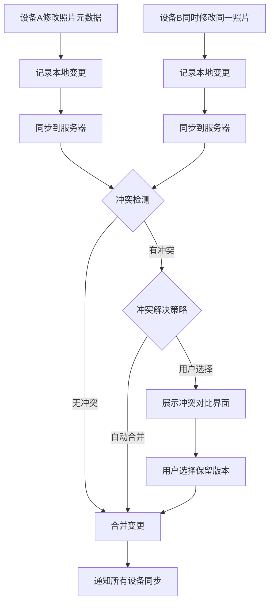

# 5.11 跨平台同步与离线

| 模块信息 | 内容 |
|---------|------|
| **模块编号** | 5.11 |
| **模块名称** | 跨平台同步与离线 |
| **优先级** | P0-P1（核心功能） |
| **依赖模块** | 5.1（用户与账户管理 — 同步关联用户）、5.3（媒体导入与存储 — 同步读写存储） |

---

## 模块概述

本模块负责系统在多平台间的数据同步能力，包括 Web 端（PWA）、移动端 App、增量同步机制、离线访问和冲突解决。作为系统的"连接层"，本模块确保用户在任何设备上都能访问和同步自己的照片。

---

## 子功能详细说明

### 5.11.1 Web 端

| 功能 | 描述 | 优先级 |
|------|------|:------:|
| 响应式设计 | 适配桌面/平板/手机浏览器 | P0 |
| PWA 支持 | 可安装为桌面/移动端应用 | P1 |
| 完整功能 | Web 端提供上传/管理/浏览/编辑完整功能 | P0 |
| 渐进式体验 | 根据网络状况自动调整体验（低网速时降低图片质量） | P2 |
| Service Worker | 离线缓存和后台同步 | P1 |

**用户故事：**

> 作为用户，我希望在手机浏览器中使用完整功能，以便无需安装 App 也能管理照片。

> 作为用户，我希望将网页安装为 PWA 应用，以便像原生应用一样使用。

**验收标准：**

```gherkin
Scenario: 响应式设计
  Given 用户在手机浏览器中访问系统
  Then 界面自动适配手机屏幕尺寸
  And 导航栏折叠为汉堡菜单
  And 图片墙显示为单列或双列布局
  And 所有功能正常可用

Scenario: PWA 安装
  Given 用户在浏览器中访问系统
  When 浏览器显示"安装应用"提示
  And 用户点击安装
  Then 系统安装为 PWA 应用
  And 可从桌面/启动器直接打开
  And 以独立窗口运行（无浏览器地址栏）
```

---

### 5.11.2 移动端 App

| 功能 | 描述 | 优先级 |
|------|------|:------:|
| iOS 支持 | 支持 iOS 平台（iOS 15+） | P1 |
| Android 支持 | 支持 Android 平台（Android 10+） | P1 |
| 自动后台备份 | 检测新照片后自动上传 | P1 |
| 网络策略 | Wi-Fi / 蜂窝网络切换策略 | P1 |
| 上传质量选择 | 原始文件 / 优化压缩 | P1 |
| 移动端浏览 | 照片浏览、相册管理、搜索 | P1 |
| 移动端编辑 | 基础编辑功能（裁剪、旋转、滤镜） | P2 |
| 桌面小组件 | 桌面/锁屏小组件显示回忆照片 | P2 |
| 快捷操作 | 长按 App 图标快捷操作（上传、扫描） | P2 |

**自动备份配置：**

| 配置项 | 选项 | 默认值 |
|--------|------|--------|
| 启用自动备份 | 开/关 | 开 |
| 备份来源 | 相机胶卷 / 所有相册 | 相机胶卷 |
| 网络条件 | 仅 Wi-Fi / Wi-Fi + 蜂窝 | 仅 Wi-Fi |
| 上传质量 | 原始 / 优化 | 原始 |
| 视频备份 | 开/关 | 开 |
| 后台备份 | 开/关 | 开 |

**用户故事：**

> 作为家庭用户，我希望安装手机 App 后照片能自动备份到家庭服务器，释放手机存储空间。

> 作为用户，我希望选择仅在 Wi-Fi 环境下自动备份，以便节省蜂窝数据流量。

**验收标准：**

```gherkin
Scenario: 移动端自动备份
  Given 用户已在手机上安装 App 并登录
  And 配置了 Wi-Fi 环境下自动备份
  When 用户用手机拍摄了新照片并连接到 Wi-Fi
  Then App 自动将新照片上传到服务器
  And 上传完成后显示"已备份"标记
  And 用户可选择清理手机上已备份的原始照片

Scenario: 网络策略
  Given 用户配置了"仅 Wi-Fi"自动备份
  When 用户使用蜂窝网络拍摄照片
  Then App 不自动上传
  And 显示"等待 Wi-Fi 连接"状态
  When 用户连接到 Wi-Fi
  Then App 开始自动上传
```

---

### 5.11.3 多设备同步

| 功能 | 描述 | 优先级 |
|------|------|:------:|
| 增量同步 | 仅传输变更部分（文件差异检测） | P1 |
| 同步状态指示 | 显示已同步/同步中/冲突状态 | P1 |
| 首次全量同步 | 新设备首次登录时的全量同步策略 | P1 |
| 双向同步 | 设备到服务器、服务器到设备 | P1 |
| 同步优先级 | 可配置同步优先级（元数据优先 / 文件优先） | P2 |
| 同步日志 | 记录同步操作日志 | P2 |

**同步流程：**



**用户故事：**

> 作为用户，我希望在手机上编辑照片的标签后，变更自动同步到服务器和其他设备。

> 作为用户，我希望新设备登录后自动同步所有照片的元数据和缩略图，以便快速开始使用。

**验收标准：**

```gherkin
Scenario: 增量同步
  Given 用户在手机上为一张照片添加了标签"风景"
  When 网络可用时
  Then 仅同步该照片的标签变更（不重新传输文件）
  And 同步完成后其他设备上该照片也显示"风景"标签
  And 同步状态指示器显示"已同步"

Scenario: 首次全量同步
  Given 用户在新设备上首次登录
  Then 系统开始全量同步
  And 优先同步元数据和缩略图（不下载原始文件）
  And 同步完成后用户可以浏览所有照片的缩略图
  And 原始文件按需下载（点击查看时下载）
```

---

### 5.11.4 离线访问

| 功能 | 描述 | 优先级 |
|------|------|:------:|
| 离线缓存 | 缓存最近浏览和收藏的内容 | P2 |
| 离线浏览 | 无网络时浏览已缓存的内容 | P2 |
| 离线操作 | 离线时的操作（收藏、标签等）加入队列 | P2 |
| 自动同步 | 网络恢复后自动同步离线操作 | P2 |
| 缓存管理 | 查看和管理离线缓存大小 | P2 |
| 选择性缓存 | 用户可选择哪些相册/照片缓存到本地 | P2 |

**用户故事：**

> 作为用户，我希望在无网络环境下仍能浏览已缓存的照片，以便在旅途中回顾照片。

**验收标准：**

```gherkin
Scenario: 离线访问与同步
  Given 用户之前浏览过某些照片（已缓存）
  When 用户断开网络后打开 App
  Then 可以浏览已缓存的照片
  And 用户对照片的操作（如收藏）被记录在队列中
  When 网络恢复
  Then 离线操作自动同步到服务器
  And 同步完成后离线操作队列清空
```

---

### 5.11.5 冲突解决

| 功能 | 描述 | 优先级 |
|------|------|:------:|
| 冲突检测 | 基于版本号/时间戳检测冲突 | P1 |
| 自动合并 | 元数据层面的自动合并（如不同字段修改） | P2 |
| 用户选择 | 提供冲突对比界面让用户选择 | P2 |
| 可配置策略 | 服务端优先/客户端优先/最新优先 | P2 |
| 冲突日志 | 记录冲突解决历史 | P2 |

**冲突解决策略：**

| 策略 | 说明 | 适用场景 |
|------|------|---------|
| 自动合并 | 不同字段的修改自动合并（如 A 改了标签，B 改了描述） | 大多数场景 |
| 最新优先 | 保留最后修改的版本 | 简单场景 |
| 用户选择 | 展示冲突对比界面，用户手动选择 | 同一字段冲突 |

**用户故事：**

> 作为用户，我希望在多设备同步出现冲突时系统能自动合并不同字段的修改，以便减少手动干预。

> 作为用户，我希望在同一字段冲突时看到对比界面并手动选择，以便保留正确的版本。

**验收标准：**

```gherkin
Scenario: 自动合并
  Given 设备A修改了照片的标签
  And 设备B同时修改了同一照片的描述
  When 两个设备同步到服务器
  Then 系统自动合并：标签和描述都保留
  And 不需要用户手动干预

Scenario: 用户选择冲突解决
  Given 设备A和设备B同时修改了同一照片的标签
  When 同步时检测到冲突
  Then 系统展示冲突对比界面
  And 显示两个版本的标签差异
  And 用户可以选择保留哪个版本或手动合并
```

---

## 模块级用户故事

> 作为家庭用户，我希望手机上的照片能自动备份到家庭服务器，多设备间无缝同步，离线时也能浏览已缓存的照片。

> 作为摄影爱好者，我希望在手机上标记精选照片后，回到电脑上能看到同步后的标签变更。

> 作为用户，我希望新设备登录后快速同步元数据和缩略图，原始文件按需下载以节省空间。

---

## 模块级验收标准

```gherkin
Scenario: 完整同步流程
  Given 用户在手机 App 和 Web 端都登录了同一账户
  When 用户在手机上上传 10 张照片
  Then 照片自动同步到服务器
  And Web 端刷新后可以看到这 10 张照片
  When 用户在 Web 端为其中 5 张添加标签
  Then 手机端同步后也显示这些标签
  And 同步状态指示器显示"已同步"

Scenario: 离线到在线同步
  Given 用户在离线环境下浏览了 20 张照片
  And 对其中 5 张添加了收藏
  When 网络恢复
  Then 5 个收藏操作自动同步到服务器
  And 其他设备上这些照片也显示为已收藏
```

---

## 依赖关系

```
5.11 跨平台同步与离线
  ├── 依赖：5.1 用户与账户管理（同步关联用户）
  ├── 依赖：5.3 媒体导入与存储（同步读写存储）
  ├── 依赖：5.14 通知与消息中心（同步状态通知）
  └── 被依赖：所有需要多设备访问的模块
```
