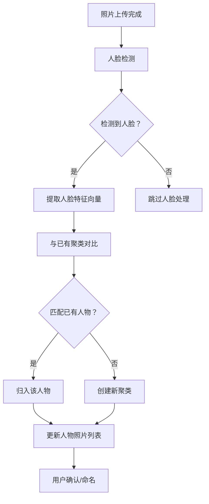

# 5.13 AI 引擎与智能服务

| 模块信息 | 内容 |
|---------|------|
| **模块编号** | 5.13 |
| **模块名称** | AI 引擎与智能服务 |
| **优先级** | P1（核心完善功能） |
| **依赖模块** | 5.3（媒体导入与存储 — 上传后触发 AI 处理）、5.12（开放平台与运维 — AI 模型插件） |

---

## 模块概述

本模块是系统的 AI 基础设施层，提供人脸检测与识别、场景与物体识别、图像嵌入与向量索引、自动标签服务等核心 AI 能力。作为独立的基础设施模块，本模块向上为组织分类（5.5）、搜索检索（5.6）、浏览展示（5.7）和媒体编辑（5.8）等模块提供智能服务支撑。

> **设计原则**：所有 AI 模型在本地运行，无需调用外部 API，保障数据隐私。

---

## 子功能详细说明

### 5.13.1 AI 模型管理

| 功能 | 描述 | 优先级 |
|------|------|:------:|
| 模型下载 | 从官方源或插件市场下载 AI 模型 | P1 |
| 模型版本管理 | 管理已安装模型的版本 | P1 |
| 模型切换 | 在不同模型版本间切换 | P2 |
| GPU 加速 | 支持 GPU 加速推理（可选） | P1 |
| CPU 推理 | 无 GPU 时使用 CPU 推理（功能完整但速度较慢） | P1 |
| 模型状态监控 | 模型加载状态、内存占用、推理速度 | P2 |
| 自动更新 | 可配置模型自动更新策略 | P2 |

**核心模型清单：**

| 模型 | 用途 | 大小（约） | GPU 加速 |
|------|------|----------|:--------:|
| 人脸检测模型 | 检测照片中的人脸区域 | 100MB | ✅ |
| 人脸识别模型 | 将人脸嵌入向量用于聚类 | 150MB | ✅ |
| 场景分类模型 | 识别场景类型（风景/人像/美食等） | 200MB | ✅ |
| 物体识别模型 | 识别照片中的物体 | 300MB | ✅ |
| 图像嵌入模型（CLIP） | 生成图像向量用于语义搜索 | 500MB | ✅ |
| 图像超分辨率模型 | 低分辨率图片增强（可选） | 50MB | ✅ |

**用户故事：**

> 作为超级管理员，我希望查看已安装的 AI 模型列表和状态，以便了解系统的 AI 能力。

> 作为超级管理员，我希望在有 GPU 的服务器上启用 GPU 加速，以便提升 AI 处理速度。

**验收标准：**

```gherkin
Scenario: 模型管理
  Given 管理员打开 AI 模型管理页面
  Then 显示所有已安装模型的列表
  And 每个模型显示：名称、版本、大小、状态（已加载/未加载）
  And 管理员可以切换模型版本
  And 管理员可以下载新模型

Scenario: GPU 加速
  Given 服务器配备 NVIDIA GPU
  When 管理员启用 GPU 加速
  Then AI 推理使用 GPU
  And 推理速度显著提升（如 10x）
  When GPU 不可用时
  Then 自动降级到 CPU 推理
  And 功能完整但速度较慢
```

---

### 5.13.2 人脸检测与识别

| 功能 | 描述 | 优先级 |
|------|------|:------:|
| 人脸检测 | 自动检测照片中的人脸区域 | P1 |
| 人脸质量评估 | 评估人脸图片质量（模糊、侧脸、遮挡） | P2 |
| 人脸聚类 | 将相似人脸自动聚类分组 | P1 |
| 人物命名 | 为人脸聚类命名 | P1 |
| 自动识别 | 命名后自动将新照片中匹配的人脸归入该人物 | P1 |
| 按人物浏览 | 通过人物列表浏览该人物的所有照片 | P1 |
| 人物合并 | 将两个聚类合并为同一人物 | P1 |
| 人物隐藏 | 隐藏不想显示的人物 | P2 |
| 人物封面 | 自动选择或手动设置人物代表照片 | P1 |

**人脸处理流程：**



**用户故事：**

> 作为家庭用户，我希望系统能自动识别照片中的人物并让我为他们命名，以便后续能快速按人物查找照片。

> 作为用户，我希望系统自动将新照片中的人物归入已命名的人物，以便减少手动操作。

**验收标准：**

```gherkin
Scenario: 人脸检测与聚类
  Given 系统已完成人脸检测扫描
  When 系统检测到多组相似的人脸
  Then 在"人物"视图中展示各个人物聚类
  And 每个聚类显示代表照片和照片数量
  And 用户可为聚类命名

Scenario: 自动识别
  Given 用户已将一个聚类命名为"爸爸"
  When 新照片上传并完成人脸检测
  Then 系统自动识别照片中是否包含"爸爸"
  And 匹配的照片自动归入"爸爸"人物
  And 用户可在人物视图中查看所有"爸爸"的照片

Scenario: 人物合并
  Given 系统中有两个聚类"人物A"和"人物B"
  When 用户确认它们是同一个人
  Then 用户可以合并两个聚类
  And 合并后的聚类包含所有照片
  And 用户选择保留的名称
```

---

### 5.13.3 场景与物体识别

| 功能 | 描述 | 优先级 |
|------|------|:------:|
| 场景分类 | 自动识别场景类型（风景、人像、美食、建筑、动物、夜景、室内、户外等） | P1 |
| 物体识别 | 自动识别照片中的物体（车辆、动物、食物、植物、天空、水面等） | P1 |
| 颜色分析 | 分析照片的主色调和色彩分布 | P2 |
| 图像质量评估 | 评估照片的清晰度、曝光、构图质量 | P2 |
| 多标签输出 | 每张照片输出多个分类标签和置信度 | P1 |
| 分类模型自定义 | 通过插件系统加载自定义分类模型 | P2 |

**支持的场景类别：**

| 大类 | 子类 |
|------|------|
| 自然 | 风景、山脉、海洋、湖泊、森林、天空、日落/日出、星空 |
| 城市 | 建筑、街道、桥梁、城市天际线 |
| 人物 | 人像、群体照、运动 |
| 美食 | 食物、饮品、烹饪 |
| 动物 | 宠物、野生动物、鸟类、昆虫 |
| 室内 | 室内、家具、装饰 |
| 交通 | 车辆、飞机、船舶、火车 |
| 活动 | 运动、旅行、婚礼、派对 |

**用户故事：**

> 作为用户，我希望系统自动识别照片的场景类型并打标签，以便快速按场景筛选照片。

> 作为摄影爱好者，我希望系统自动识别照片中的物体（如"包含狗和海滩"），以便通过组合标签精确查找。

**验收标准：**

```gherkin
Scenario: 场景分类
  Given 一张包含海滩和日落的照片被上传
  When AI 处理完成
  Then 该照片被自动标记"海滩"和"日落"标签
  And 每个标签附带置信度分数
  And 置信度低于阈值的标签不自动应用

Scenario: 物体识别
  Given 一张包含猫和沙发的室内照片
  When AI 处理完成
  Then 该照片被标记"猫"、"沙发"、"室内"标签
  And 用户可以在照片详情中查看所有 AI 标签
  And 用户可以移除不准确的标签
```

---

### 5.13.4 图像嵌入与向量索引

| 功能 | 描述 | 优先级 |
|------|------|:------:|
| 图像嵌入生成 | 使用 CLIP 等模型为每张照片生成向量嵌入 | P1 |
| 向量索引构建 | 增量构建和更新向量索引 | P1 |
| 向量索引重建 | 管理员触发全量向量索引重建 | P2 |
| 索引状态监控 | 向量索引的构建进度和状态 | P1 |
| 索引优化 | 定期优化向量索引性能 | P2 |

**向量嵌入用途：**

| 用途 | 消费模块 | 说明 |
|------|---------|------|
| 语义搜索 | 5.6 搜索与检索 | 自然语言查询 → 向量匹配 |
| 以图搜图 | 5.6 搜索与检索 | 参考图 → 向量相似度匹配 |
| 相似照片检测 | 5.5 组织与分类 | 向量距离 < 阈值 → 相似照片 |
| 回忆生成 | 5.7 浏览与展示 | 时间+向量聚类 → 主题回忆 |

**用户故事：**

> 作为用户，我希望系统在后台自动为每张照片生成向量嵌入，以便支持自然语言搜索和以图搜图。

> 作为超级管理员，我希望查看向量索引的构建状态，以便了解 AI 处理进度。

**验收标准：**

```gherkin
Scenario: 向量索引构建
  Given 用户上传了 100 张照片
  When AI 处理完成
  Then 每张照片生成了向量嵌入
  And 向量索引已更新
  And 用户可以通过自然语言搜索这些照片

Scenario: 向量索引重建
  Given 管理员触发全量向量索引重建
  Then 系统重新为所有照片生成向量嵌入
  And 显示重建进度
  And 重建完成后语义搜索功能正常可用
```

---

### 5.13.5 自动标签服务

| 功能 | 描述 | 优先级 |
|------|------|:------:|
| 自动标签建议 | AI 分析后自动建议标签 | P1 |
| 标签置信度阈值 | 可配置自动标签的置信度阈值 | P1 |
| 标签审核模式 | 自动标签需用户确认后才生效 | P2 |
| 标签黑名单 | 排除不需要的自动标签 | P2 |
| 批量标签确认 | 批量确认/拒绝 AI 建议的标签 | P2 |

**用户故事：**

> 作为用户，我希望系统自动建议标签，我只需确认即可，节省手动打标签时间。

> 作为超级管理员，我希望设置标签置信度阈值为 0.8，只有高置信度的标签才自动应用。

**验收标准：**

```gherkin
Scenario: 自动标签建议
  Given 系统配置为"自动标签 + 审核模式"
  When AI 分析完一张照片并建议标签"海滩"(0.95)、"日落"(0.88)、"船只"(0.65)
  Then 置信度 ≥ 0.8 的标签（"海滩"、"日落"）自动应用
  And 置信度 < 0.8 的标签（"船只"）显示为"待确认"
  And 用户可以逐一确认或拒绝待确认标签
```

---

### 5.13.6 智能搜索支持

| 功能 | 描述 | 优先级 |
|------|------|:------:|
| 自然语言解析 | 解析用户输入的自然语言查询 | P1 |
| 语义匹配 | 将查询意图与照片向量进行匹配 | P1 |
| 搜索结果排序 | 按语义相关度排序搜索结果 | P1 |
| 搜索建议 | 基于历史搜索和 AI 分类提供搜索建议 | P2 |

> 此功能为 [5.6 搜索与检索](./5.6-搜索与检索.md) 模块的图像内容搜索提供底层支持。

**用户故事：**

> 作为用户，我希望输入"海边日落"这样的自然语言描述来搜索照片，即使照片没有相关标签也能找到匹配结果。

> 作为用户，我希望在搜索框中看到基于 AI 分类的搜索建议，以便快速找到想要的照片。

**验收标准：**

```gherkin
Scenario: 自然语言语义搜索
  Given 系统已完成所有照片的向量嵌入
  When 用户输入"海边日落"进行搜索
  Then 系统将查询文本转换为向量
  And 与照片向量进行语义匹配
  And 返回语义最相关的照片（即使没有"海边"或"日落"标签）
  And 结果按语义相关度排序

Scenario: 搜索建议
  Given 系统已完成 AI 场景分类
  When 用户在搜索框中输入"猫"
  Then 系统显示搜索建议（如"猫咪"、"猫和狗"、"室内猫"）
  And 建议基于 AI 分类标签和历史搜索
```

---

### 5.13.7 回忆生成

| 功能 | 描述 | 优先级 |
|------|------|:------:|
| 时间聚类 | 按时间段（同一天/同一周/同一月）聚类照片 | P1 |
| 地点聚类 | 按拍摄地点聚类照片 | P1 |
| 人物聚类 | 按出现的人物聚类照片 | P1 |
| 主题聚类 | 综合时间+地点+人物+场景的主题聚类 | P2 |
| 回忆精选 | 从聚类中自动选择最佳照片作为封面 | P2 |
| 回忆标题 | 自动生成回忆标题（如"去年夏天的海边之旅"） | P2 |

> 此功能为 [5.7 浏览与展示](./5.7-浏览与展示.md) 模块的回忆 Memories 功能提供底层支持。

**用户故事：**

> 作为家庭用户，我希望系统自动将同一次旅行的照片聚类为一个回忆，并生成有意义的标题，以便回顾美好时光。

> 作为用户，我希望系统基于时间、地点和人物的组合自动生成主题回忆，以便发现意想不到的照片关联。

**验收标准：**

```gherkin
Scenario: 时间地点聚类
  Given 系统中有 2025 年 8 月 10-15 日在三亚拍摄的照片
  When AI 回忆生成分析完成
  Then 系统将这批照片聚类为一个回忆
  And 自动生成标题（如"2025年8月 三亚之旅"）
  And 从聚类中选择最佳照片作为封面

Scenario: 主题聚类
  Given 系统中有多次包含"生日"场景的照片
  When AI 分析完成
  Then 系统生成"生日聚会"主题回忆
  And 回忆包含不同时间的生日照片
  And 用户可在回忆页面查看和编辑
```

---

### 5.13.8 AI 处理管线与队列

| 功能 | 描述 | 优先级 |
|------|------|:------:|
| 处理队列 | 异步处理队列，不阻塞上传流程 | P1 |
| 优先级队列 | 可配置处理优先级（新上传 > 重新扫描） | P2 |
| 队列监控 | 查看队列长度、处理速度、平均等待时间 | P1 |
| 暂停/恢复 | 管理员可暂停/恢复 AI 处理 | P2 |
| 资源限制 | 限制 AI 处理的 CPU/内存/GPU 占用 | P1 |
| 错误处理 | AI 处理失败时自动重试并记录错误 | P1 |

**AI 处理管线流程：**

```
照片上传完成
    ↓
加入 AI 处理队列
    ↓
① 提取图像嵌入向量（CLIP）    → 更新向量索引
② 人脸检测与聚类              → 更新人物数据
③ 场景与物体识别              → 生成自动标签
④ 回忆聚类分析                → 更新回忆数据
    ↓
处理完成，通知用户
```

**用户故事：**

> 作为超级管理员，我希望查看 AI 处理队列的状态，以便了解处理进度和系统负载。

> 作为超级管理员，我希望限制 AI 处理的 CPU 占用不超过 50%，以便不影响系统的其他功能。

**验收标准：**

```gherkin
Scenario: AI 处理管线
  Given 用户上传了 10 张照片
  When 上传完成
  Then 10 张照片加入 AI 处理队列
  And 系统异步处理（不阻塞上传流程）
  And 每张照片依次完成：向量生成、人脸检测、场景识别
  And 处理完成后照片可被搜索和分类

Scenario: 资源限制
  Given 管理员配置 AI 处理 CPU 限制为 50%
  When AI 处理运行时
  Then CPU 占用不超过 50%
  And 系统的其他功能（上传、浏览、搜索）不受影响
```

---

## 模块级用户故事

> 作为超级管理员，我希望系统自动为每张上传的照片进行 AI 分析（人脸、场景、物体、向量嵌入），以便支持智能分类和语义搜索。

> 作为用户，我希望系统自动识别人物并让我命名，之后自动将新照片归入对应人物，减少手动操作。

> 作为超级管理员，我希望在无 GPU 的服务器上也能使用 AI 功能（CPU 推理），并在有 GPU 时自动加速。

---

## 模块级验收标准

```gherkin
Scenario: 完整 AI 处理流程
  Given 用户上传了 100 张包含人物和风景的照片
  When AI 处理完成
  Then 每张照片生成了向量嵌入
  And 人脸被检测并聚类
  And 场景和物体被识别并生成标签
  And 用户可以通过人物浏览、场景标签搜索、自然语言搜索找到照片

Scenario: AI 降级
  Given AI 引擎服务不可用（模型未安装或服务异常）
  When 用户上传新照片
  Then 照片正常上传和存储
  And 元数据提取和缩略图生成正常
  And AI 相关功能（人脸识别、场景分类、语义搜索）不可用
  And 系统显示"AI 功能不可用"提示
  When AI 引擎恢复
  Then 系统自动处理积压的 AI 任务
```

---

## 依赖关系

```
5.13 AI 引擎与智能服务（基础设施层）
  ├── 依赖：5.3 媒体导入与存储（上传后触发 AI 处理）
  ├── 依赖：5.12 开放平台与运维（AI 模型插件、系统资源限制）
  ├── 服务于：5.5 组织与分类（自动标签、人物识别、堆叠检测）
  ├── 服务于：5.6 搜索与检索（语义搜索、以图搜图）
  ├── 服务于：5.7 浏览与展示（回忆生成）
  └── 服务于：5.8 媒体编辑（AI 增强编辑）
```

> **架构说明**：本模块作为 AI 基础设施层，不直接面向用户。用户通过 5.5（组织分类）、5.6（搜索）、5.7（浏览）、5.8（编辑）等上层模块消费 AI 能力。这种分层设计确保 AI 能力的边界清晰、可独立演进。
