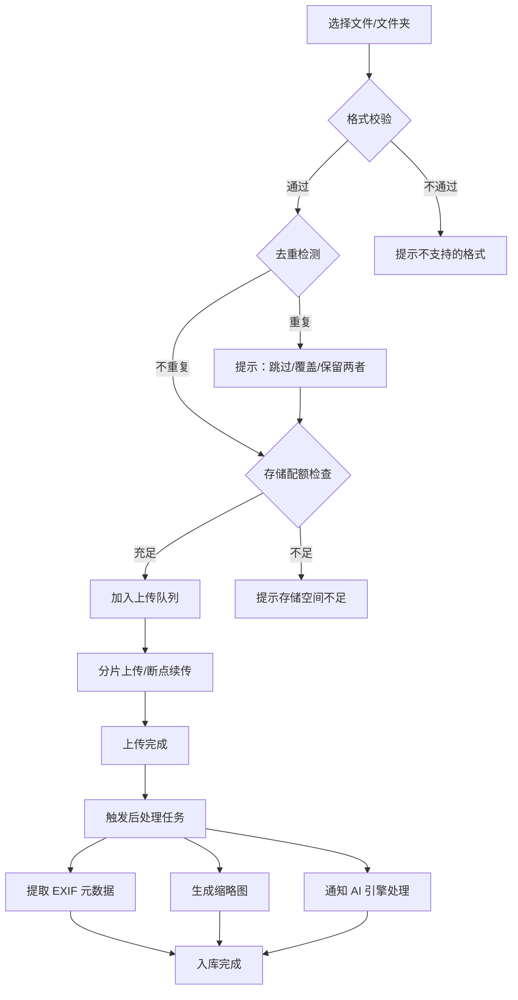

# 5.3 媒体导入与存储

| 模块信息 | 内容 |
|---------|------|
| **模块编号** | 5.3 |
| **模块名称** | 媒体导入与存储 |
| **优先级** | P0（核心基础功能） |
| **依赖模块** | 5.1（用户与账户管理）、5.2（安全与访问控制）、5.13（AI 引擎 — 上传后触发 AI 处理） |

---

## 模块概述

本模块负责照片和视频文件的上传导入、格式支持、元数据管理、本地存储策略和文件去重。作为系统的数据入口，本模块确保所有媒体文件被正确接收、安全存储、元数据完整提取，并为后续的 AI 处理和索引构建做好准备。

---

## 子功能详细说明

### 5.3.1 批量上传

| 功能 | 描述 | 优先级 |
|------|------|:------:|
| 拖拽上传 | 将文件/文件夹拖拽到上传区域 | P0 |
| 文件夹上传 | 选择整个文件夹进行上传（保留目录结构） | P0 |
| 多文件选择 | 文件选择器支持多选 | P0 |
| 上传进度显示 | 总体进度 + 单文件进度条 + 预计剩余时间 | P0 |
| 断点续传 | 网络中断后可从断点继续上传 | P0 |
| 失败重试 | 上传失败的文件自动/手动重试 | P0 |
| 上传队列管理 | 暂停、恢复、取消上传任务 | P1 |
| 后台上传 | 移动端支持后台上传，不影响其他操作 | P0 |
| 上传去重检测 | 上传时自动检测重复文件并提示 | P1 |
| 上传前预检 | 上传前检查存储配额和文件格式 | P0 |

**上传流程：**



**用户故事：**

> 作为摄影爱好者，我希望拖拽一个包含 500 张 RAW 格式照片的文件夹进行批量上传，并看到上传进度和预计剩余时间。

> 作为家庭用户，我希望手机上的新照片能在 Wi-Fi 环境下自动备份到服务器，以便释放手机存储空间。

> 作为用户，我希望上传中断后能自动从断点继续，避免大文件需要重新上传。

**验收标准：**

```gherkin
Scenario: 批量文件夹上传
  Given 用户在 Web 端上传页面
  When 用户拖拽一个包含100张JPEG照片的文件夹到上传区域
  Then 系统显示上传队列和总体进度
  And 逐个上传文件并显示单文件进度
  And 上传完成后自动触发元数据提取和缩略图生成

Scenario: 断点续传
  Given 用户正在上传一个大文件（如 500MB RAW）
  When 网络连接中断后恢复
  Then 系统自动从断点处继续上传
  And 不需要重新上传已传输的部分

Scenario: 上传去重
  Given 系统中已存在文件哈希为 ABC123 的照片
  When 用户上传一个文件哈希同样为 ABC123 的照片
  Then 系统提示"该文件已存在"
  And 用户可选择：跳过 / 覆盖 / 保留两者

Scenario: 存储配额检查
  Given 用户的存储配额为 10GB，已使用 9.8GB
  When 用户尝试上传 500MB 的文件
  Then 系统在上传前提示"存储空间不足"
  And 不执行上传
```

---

### 5.3.2 多格式支持

| 类别 | 支持格式 | 优先级 |
|------|---------|:------:|
| **常见图片** | JPEG (.jpg/.jpeg)、PNG (.png)、WebP (.webp)、BMP (.bmp)、GIF (.gif) | P0 |
| **高清格式** | TIFF (.tiff/.tif)、HEIC/HEIF (.heic/.heif) | P0 |
| **RAW 格式** | CR2/CR3（Canon）、NEF/NRW（Nikon）、ARW（Sony）、DNG（通用）、ORF（Olympus）、RAF（Fujifilm） | P1 |
| **视频格式** | MP4 (.mp4)、MOV (.mov)、MKV (.mkv)、WebM (.webm)、AVI (.avi) | P1 |
| **特殊格式** | AVIF (.avif)、SVG (.svg)、PDF（仅预览） | P2 |
| **全景/360°** | 等距矩形投影全景图 | P2 |
| **Live Photos** | Apple Live Photos（.MOV + .HEIC 配对） | P2 |

**视频支持详情：**

| 功能 | 描述 | 优先级 |
|------|------|:------:|
| 视频上传 | 支持常见视频格式的上传和存储 | P1 |
| 视频缩略图 | 自动从视频中提取关键帧作为缩略图 | P1 |
| 视频元数据 | 提取视频时长、分辨率、编码格式等元数据 | P1 |
| 视频预览 | Web 端内嵌视频播放器预览 | P1 |
| 视频转码（可选） | 自动将视频转码为 Web 友好格式（需硬件支持） | P2 |
| Motion Photos | 支持 Google/Apple Motion Photos 的静态+动态部分分离 | P2 |

**用户故事：**

> 作为用户，我希望上传 iPhone 拍摄的 HEIC 格式照片，系统能正确显示和预览。

> 作为用户，我希望上传手机拍摄的视频和照片，系统能统一管理和浏览。

**验收标准：**

```gherkin
Scenario: HEIC 格式支持
  Given 用户上传一张 HEIC 格式的照片
  When 上传完成
  Then 系统正确生成缩略图
  And Web 端能正常预览该照片
  And EXIF 元数据正确提取

Scenario: 视频上传与预览
  Given 用户上传一个 MP4 格式的视频
  When 上传完成
  Then 系统自动提取视频缩略图
  And 在浏览页面显示视频时长标识
  And 点击后可在 Web 端内嵌播放器中播放
```

---

### 5.3.3 EXIF/IPTC/XMP 元数据管理

| 功能 | 描述 | 优先级 |
|------|------|:------:|
| EXIF 自动提取 | 拍摄日期时间、相机/镜头型号、光圈、快门、ISO、GPS 坐标、尺寸、分辨率、方向 | P0 |
| IPTC 字段解析 | 标题、描述、关键词、版权信息、作者 | P1 |
| XMP 侧车文件 | 解析外部 .xmp 元数据文件并与照片关联 | P1 |
| 元数据编辑界面 | 图形化界面编辑照片的元数据字段 | P1 |
| 元数据写入 | 修改元数据后写回原始文件（可选） | P2 |
| XMP Sidecar 读写 | 将元数据变更写入 XMP 侧车文件而非修改原始文件 | P2 |
| GPS 反向地理编码 | 将 GPS 坐标转换为可读地名（使用离线地理编码库） | P1 |
| 元数据批量编辑 | 批量修改多张照片的元数据（如批量修正时区偏移） | P2 |
| 元数据导入/导出 | 从 CSV/JSON 导入或导出元数据 | P2 |

**用户故事：**

> 作为摄影爱好者，我希望在上传后自动提取相机的 EXIF 信息（型号、镜头、参数），以便按设备筛选照片。

> 作为用户，我希望在图形化界面中编辑照片的标题、描述和关键词，以便更好地组织照片。

> 作为摄影爱好者，我希望批量修正旅行照片的时区偏移，以便时间线显示正确。

**验收标准：**

```gherkin
Scenario: EXIF 自动提取
  Given 用户上传一张包含完整 EXIF 信息的 JPEG 照片
  When 上传完成并处理后
  Then 系统提取并存储：拍摄日期、相机型号、镜头型号、光圈、快门、ISO、GPS 坐标
  And 在照片详情面板中完整展示

Scenario: GPS 反向地理编码
  Given 一张照片包含 GPS 坐标（39.9042°N, 116.4074°E）
  When 元数据提取完成
  Then 系统使用离线地理编码库将坐标转换为"中国北京市天安门"
  And 在照片详情中显示拍摄地点名称

Scenario: 元数据写入
  Given 用户修改了一张照片的标题和关键词
  When 用户选择"将元数据写入文件"
  Then 系统将修改后的元数据写回原始文件
  And 不影响照片的图像数据
```

---

### 5.3.4 本地存储策略

| 功能 | 描述 | 优先级 |
|------|------|:------:|
| 存储路径可配置 | 支持自定义原始文件存储路径 | P0 |
| 外部存储挂载 | 支持挂载 NAS、外接硬盘等外部存储 | P0 |
| 存储模板 | 自定义文件在磁盘上的存储路径结构（如 `YYYY/MM/DD/filename`） | P1 |
| 文件命名规则 | 可配置的文件命名规则（保留原名 / UUID / 自定义模板） | P1 |
| 存储配额管理 | 监控和限制用户/系统的存储使用量 | P1 |
| 存储健康检测 | 定期校验文件完整性（哈希比对） | P2 |
| 存储空间预警 | 存储空间不足时发出告警（通过 5.14 通知模块） | P1 |
| 存储分层 | 原始文件、缩略图、AI 数据分离存储路径 | P1 |

**存储模板示例：**

| 模板 | 路径结构 | 说明 |
|------|---------|------|
| 按日期 | `uploads/YYYY/MM/DD/` | 按拍摄日期分目录 |
| 按用户 | `uploads/user_id/` | 按用户分目录 |
| 按类型 | `uploads/photos/` + `uploads/videos/` | 按文件类型分目录 |
| 扁平 | `uploads/` | 所有文件在同一目录 |
| 自定义 | 管理员自定义模板 | 支持变量替换 |

**用户故事：**

> 作为超级管理员，我希望将照片存储路径配置为外部 NAS 挂载目录，以便利用大容量网络存储。

> 作为超级管理员，我希望配置存储模板为按日期组织（`YYYY/MM`），以便文件系统中的照片按时间有序存放。

**验收标准：**

```gherkin
Scenario: 外部存储挂载
  Given 管理员将存储路径配置为 /mnt/nas/photos
  When 用户上传新照片
  Then 照片原始文件存储到 /mnt/nas/photos/ 下
  And 系统正常运行不受影响

Scenario: 存储空间预警
  Given 存储空间使用率达到 90%
  Then 系统通过通知模块发送存储空间不足告警
  And 管理员在管理后台看到存储空间预警标识
```

---

### 5.3.5 文件去重

| 功能 | 描述 | 优先级 |
|------|------|:------:|
| 精确去重 | 基于文件哈希（SHA-256）检测完全相同的文件 | P1 |
| 感知哈希去重 | 基于感知哈希（pHash）检测视觉相似的照片 | P2 |
| 去重策略 | 自动跳过 / 提示用户 / 保留两者（可配置） | P1 |
| 去重扫描 | 手动触发全库去重扫描 | P2 |
| 去重结果展示 | 展示检测到的重复/相似照片组，用户可逐一处理 | P2 |

**用户故事：**

> 作为用户，我希望系统在上传时自动检测重复文件，避免同一张照片被多次上传。

> 作为摄影爱好者，我希望系统帮我找出连拍中的相似照片，以便挑选最好的保留。

**验收标准：**

```gherkin
Scenario: 精确去重
  Given 系统中已存在文件哈希为 SHA256_ABC 的照片
  When 用户上传一个文件哈希同样为 SHA256_ABC 的照片
  Then 系统根据去重策略处理（默认：提示用户）
  And 用户可选择跳过、覆盖或保留两者

Scenario: 感知哈希相似检测
  Given 用户触发全库去重扫描
  When 扫描完成
  Then 系统展示检测到的相似照片组
  And 每组显示缩略图对比和相似度百分比
  And 用户可逐一选择保留或删除
```

---

## 模块级用户故事

> 作为摄影爱好者，我希望拖拽整个拍摄文件夹（含 RAW + JPEG + 视频）进行批量上传，系统自动识别格式、提取元数据、生成缩略图，并检测重复文件。

> 作为家庭用户，我希望手机上的新照片和视频能在 Wi-Fi 环境下自动备份到家庭 NAS，上传后自动提取 GPS 信息并显示拍摄地点。

> 作为超级管理员，我希望配置存储模板将文件按 `YYYY/MM` 目录结构存放，并挂载外部存储以扩展容量。

---

## 模块级验收标准

```gherkin
Scenario: 完整上传处理流程
  Given 用户上传 10 张 JPEG 照片和 2 个 MP4 视频
  When 上传完成
  Then 所有文件成功存储
  And 照片和视频的缩略图均已生成
  And EXIF/视频元数据已提取
  And AI 处理队列已收到处理任务
  And 重复文件已检测并提示

Scenario: 存储配额执行
  Given 用户存储配额为 5GB，已使用 4.9GB
  When 用户尝试上传 200MB 的文件
  Then 系统拒绝上传并提示"存储空间不足，已使用 4.9GB/5GB"
  And 建议用户清理或联系管理员增加配额
```

---

## 依赖关系

```
5.3 媒体导入与存储
  ├── 依赖：5.1 用户与账户管理（上传操作关联用户 ID）
  ├── 依赖：5.2 安全与访问控制（上传操作需权限验证）
  ├── 依赖：5.13 AI 引擎（上传后触发 AI 处理队列）
  ├── 被依赖：5.5 组织与分类（存储的文件被组织和分类）
  ├── 被依赖：5.6 搜索与检索（元数据用于搜索索引）
  ├── 被依赖：5.7 浏览与展示（缩略图用于浏览展示）
  ├── 被依赖：5.8 媒体编辑（编辑操作作用于存储的文件）
  ├── 被依赖：5.9 媒体管理与生命周期（生命周期管理作用于存储的文件）
  └── 被依赖：5.11 跨平台同步（同步操作读取/写入存储）
```
