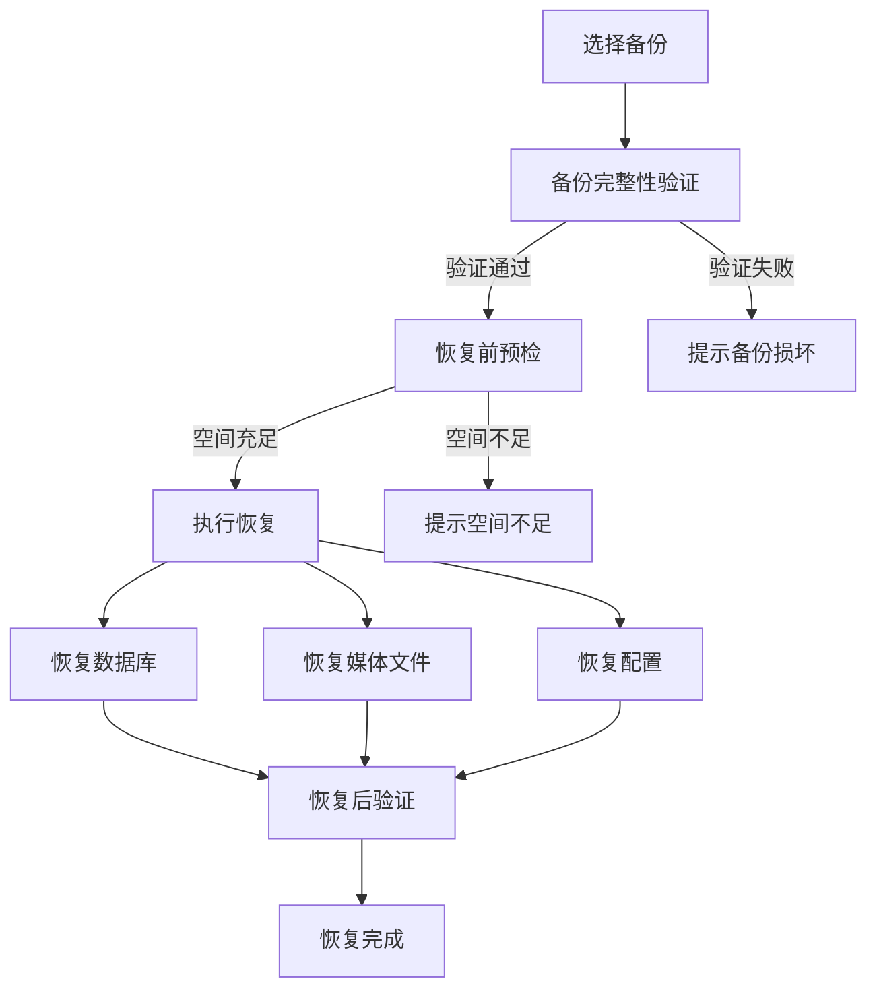

# 5.4 备份与恢复

| 模块信息 | 内容 |
|---------|------|
| **模块编号** | 5.4 |
| **模块名称** | 备份与恢复 |
| **优先级** | P1（核心完善功能） |
| **依赖模块** | 5.3（媒体导入与存储 — 备份的对象为本模块管理的文件）、5.12（开放平台与运维 — S3/WebDAV 集成） |

---

## 模块概述

本模块统一管理系统的所有备份与恢复功能，包括数据库备份、媒体文件备份、版本控制和灾难恢复。将备份功能从存储模块和扩展模块中独立出来，消除跨模块的备份策略分散问题，提供一致的备份体验和可靠的恢复保障。

---

## 子功能详细说明

### 5.4.1 备份策略

| 功能 | 描述 | 优先级 |
|------|------|:------:|
| 自动备份计划 | 可配置定时备份计划（每日/每周/每月） | P1 |
| 手动备份 | 管理员可随时触发一次性手动备份 | P1 |
| 全量备份 | 备份所有数据（数据库 + 媒体文件 + 配置） | P1 |
| 增量备份 | 仅备份自上次备份以来的变更部分 | P2 |
| 差异备份 | 备份自上次全量备份以来的所有变更 | P2 |
| 备份前检查 | 备份前自动检查存储空间和系统健康状态 | P1 |
| 备份加密 | 备份文件可选加密（使用独立备份密钥） | P2 |

**备份内容清单：**

| 内容 | 说明 | 重要性 |
|------|------|:------:|
| 数据库 | 用户数据、元数据、权限、相册、标签等结构化数据 | 关键 |
| 原始媒体文件 | 用户上传的所有照片和视频 | 关键 |
| 缩略图文件 | 生成的缩略图（可重新生成） | 中等 |
| 配置文件 | 系统配置、环境变量 | 关键 |
| AI 模型数据 | 人脸聚类、分类结果、向量索引 | 中等 |
| 插件数据 | 插件配置和状态 | 低 |

**用户故事：**

> 作为超级管理员，我希望配置每日凌晨 2 点自动备份，以便每天有一份最新的数据备份。

> 作为超级管理员，我希望在系统升级前手动触发一次完整备份，以便升级失败时可以回滚。

**验收标准：**

```gherkin
Scenario: 自动备份计划
  Given 管理员配置了"每日凌晨 2:00 自动备份"
  When 到达凌晨 2:00
  Then 系统自动执行备份
  And 备份完成后记录备份日志
  And 备份失败时通过通知模块告警

Scenario: 手动备份
  Given 管理员点击"立即备份"按钮
  Then 系统执行全量备份
  And 显示备份进度和预计剩余时间
  And 备份完成后显示备份摘要（大小、耗时、文件数）
```

---

### 5.4.2 备份目标

| 功能 | 描述 | 优先级 |
|------|------|:------:|
| 本地备份 | 备份到本地指定路径（可挂载外部硬盘） | P1 |
| S3 兼容存储 | 备份到 S3 兼容对象存储（MinIO、AWS S3、阿里云 OSS 等） | P2 |
| WebDAV | 通过 WebDAV 协议备份到远程存储 | P2 |
| 网络共享（SMB/NFS） | 备份到局域网内的网络共享目录 | P2 |
| 多目标备份 | 同时备份到多个目标（如本地 + 远程） | P2 |
| 备份轮转 | 保留最近 N 份备份，自动清理旧备份 | P1 |

**备份目标配置：**

| 配置项 | 说明 |
|--------|------|
| 目标类型 | 本地路径 / S3 / WebDAV / SMB |
| 连接信息 | 路径、凭证（加密存储） |
| 保留策略 | 保留份数（默认：最近 7 份） |
| 压缩选项 | 是否压缩备份文件 |
| 加密选项 | 是否加密备份文件 |

**用户故事：**

> 作为超级管理员，我希望将备份同时存储到本地 NAS 和远程 S3 存储，以便实现 3-2-1 备份策略。

> 作为超级管理员，我希望配置备份保留策略为最近 7 份，以便自动清理旧备份节省空间。

**验收标准：**

```gherkin
Scenario: S3 备份
  Given 管理员配置了 S3 备份目标
  When 触发备份
  Then 系统将备份数据上传到指定的 S3 存储桶
  And 上传完成后验证文件完整性

Scenario: 多目标备份
  Given 管理员配置了本地路径和 S3 两个备份目标
  When 触发备份
  Then 系统同时向两个目标写入备份数据
  And 任一目标失败不影响另一目标
  And 记录各目标的备份状态
```

---

### 5.4.3 版本控制

| 功能 | 描述 | 优先级 |
|------|------|:------:|
| 原始文件保留 | 编辑后始终保留原始文件（非破坏性编辑） | P0 |
| 版本历史 | 记录文件的编辑历史，支持版本回溯 | P1 |
| 版本对比 | 并排对比不同版本的差异 | P2 |
| 版本回滚 | 一键回滚到指定历史版本 | P1 |
| 版本自动清理 | 可配置保留版本数量上限，自动清理旧版本 | P2 |

**版本存储策略：**

| 策略 | 说明 | 存储开销 |
|------|------|---------|
| 仅保留原始 | 只保留原始文件 + 当前编辑参数 | 低 |
| 保留所有版本 | 每次编辑都生成新文件 | 高 |
| 保留最近 N 版 | 保留原始 + 最近 N 个编辑版本 | 中等 |

**用户故事：**

> 作为用户，我希望编辑照片后原始文件始终保留，以便随时恢复到未编辑状态。

> 作为摄影爱好者，我希望查看照片的编辑历史并对比不同版本，以便选择最佳效果。

**验收标准：**

```gherkin
Scenario: 非破坏性编辑版本控制
  Given 用户对一张照片进行了裁剪和调色
  When 用户查看该照片的版本历史
  Then 显示原始版本和编辑后的版本
  And 用户可以切换查看任意版本
  And 用户可以一键回滚到原始版本

Scenario: 版本自动清理
  Given 系统配置最多保留 5 个编辑版本
  When 用户对同一张照片进行了第 6 次编辑
  Then 最旧的编辑版本被自动清理
  And 原始版本始终保留
```

---

### 5.4.4 恢复流程

| 功能 | 描述 | 优先级 |
|------|------|:------:|
| 备份列表 | 展示所有可用备份（时间、大小、类型、状态） | P1 |
| 选择性恢复 | 可选择恢复特定内容（仅数据库/仅文件/全部） | P1 |
| 一键恢复 | 从指定备份一键恢复系统 | P1 |
| 恢复预检 | 恢复前检查目标存储空间和备份完整性 | P1 |
| 恢复进度 | 显示恢复进度和预计剩余时间 | P1 |
| 恢复验证 | 恢复完成后自动验证数据完整性 | P2 |
| 恢复到新位置 | 可选择恢复到新路径而非覆盖当前数据 | P2 |

**恢复流程：**



**用户故事：**

> 作为超级管理员，我希望在系统故障后从最近的备份一键恢复，以便快速恢复服务。

> 作为超级管理员，我希望在恢复前预览备份内容和检查完整性，以便确认恢复的是正确的数据。

**验收标准：**

```gherkin
Scenario: 一键恢复
  Given 系统存在一个有效的全量备份
  When 管理员选择该备份并点击"恢复"
  Then 系统执行恢复前预检（空间、完整性）
  And 显示恢复进度
  And 恢复完成后自动验证数据完整性
  And 系统恢复正常运行

Scenario: 选择性恢复
  Given 管理员只需恢复数据库（不恢复媒体文件）
  When 选择"仅恢复数据库"
  Then 仅恢复数据库备份
  And 媒体文件不受影响
```

---

### 5.4.5 备份验证与监控

| 功能 | 描述 | 优先级 |
|------|------|:------:|
| 自动验证 | 备份完成后自动校验文件完整性（哈希比对） | P2 |
| 定期验证 | 定期检查已有备份的完整性 | P2 |
| 备份状态仪表盘 | 展示备份状态概览（最近备份时间、大小、成功率） | P1 |
| 备份失败告警 | 备份失败时通过通知模块告警 | P1 |
| 存储空间趋势 | 展示备份数据的存储空间增长趋势 | P2 |

**用户故事：**

> 作为超级管理员，我希望在管理后台看到备份状态仪表盘，以便快速了解备份系统的健康状况。

> 作为超级管理员，我希望备份失败时立即收到告警通知，以便及时处理。

**验收标准：**

```gherkin
Scenario: 备份失败告警
  Given 系统配置了每日自动备份
  When 某次备份因存储空间不足而失败
  Then 系统通过通知模块发送告警
  And 管理后台显示备份失败状态
  And 备份日志中记录失败原因

Scenario: 备份状态仪表盘
  Given 系统已执行多次备份
  When 管理员查看备份仪表盘
  Then 显示：最近备份时间、备份大小、备份成功率、存储空间趋势
  And 可点击查看每次备份的详细信息
```

---

## 模块级用户故事

> 作为超级管理员，我希望配置自动备份计划并将备份数据同时存储到本地 NAS 和远程 S3，实现 3-2-1 备份策略，确保数据安全。

> 作为超级管理员，我希望在系统升级前一键备份，升级失败时能快速恢复到升级前的状态。

> 作为超级管理员，我希望系统自动验证备份完整性并在备份失败时立即告警，以便确保备份始终可用。

---

## 模块级验收标准

```gherkin
Scenario: 完整备份恢复周期
  Given 系统正常运行，包含 1000 张照片和 10 个用户
  When 管理员触发全量备份到本地路径
  Then 备份成功完成并通过完整性验证
  When 管理员删除部分照片和用户
  And 从备份恢复
  Then 所有照片和用户数据恢复到备份时的状态
  And 系统正常运行

Scenario: 3-2-1 备份策略
  Given 管理员配置了本地路径 + S3 两个备份目标
  And 设置保留最近 7 份备份
  When 系统运行 30 天
  Then 本地和 S3 各保留最近 7 份备份
  And 超过 7 份的旧备份被自动清理
  And 任一目标备份失败不影响另一目标
```

---

## 依赖关系

```
5.4 备份与恢复
  ├── 依赖：5.3 媒体导入与存储（备份的对象为本模块管理的文件）
  ├── 依赖：5.12 开放平台与运维（S3/WebDAV 集成能力）
  ├── 依赖：5.14 通知与消息中心（备份失败告警通知）
  ├── 被依赖：5.9 媒体管理与生命周期（版本控制由本模块管理）
  └── 被依赖：系统运维（灾难恢复）
```
