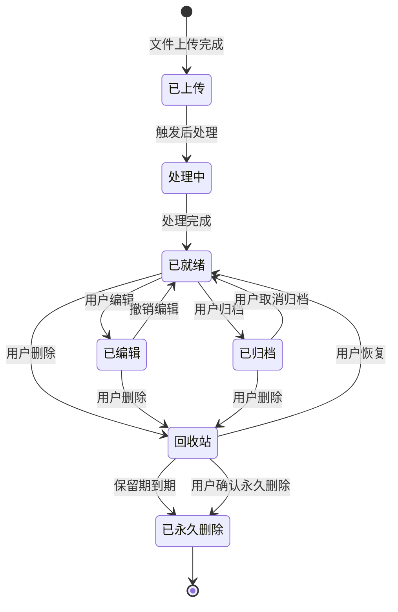

# 5.9 媒体管理与生命周期

| 模块信息 | 内容 |
|---------|------|
| **模块编号** | 5.9 |
| **模块名称** | 媒体管理与生命周期 |
| **优先级** | P1（核心完善功能） |
| **依赖模块** | 5.2（安全与访问控制 — 删除操作需权限验证）、5.3（媒体导入与存储 — 管理存储的文件）、5.14（通知与消息中心 — 存储告警通知） |

---

## 模块概述

本模块负责媒体文件的全生命周期管理，包括回收站、归档管理、批量操作和存储用量统计。作为系统的"资源管家"，本模块确保文件从上传到删除的每个状态转换都有清晰的规则和安全的保护机制。

---

## 子功能详细说明

### 5.9.1 回收站

| 功能 | 描述 | 优先级 |
|------|------|:------:|
| 软删除 | 删除的照片先进入回收站（标记为已删除） | P1 |
| 回收站浏览 | 在回收站中浏览已删除的照片 | P1 |
| 恢复操作 | 从回收站恢复照片到原位置 | P1 |
| 永久删除 | 在回收站中永久删除（不可恢复） | P1 |
| 回收站保留期 | 可配置保留天数（默认 30 天） | P1 |
| 自动清理 | 保留期到期后自动永久删除 | P1 |
| 回收站空间管理 | 显示回收站占用的存储空间 | P2 |
| 空间不足预警 | 存储空间不足时提醒清理回收站 | P2 |
| 回收站搜索 | 在回收站中搜索已删除的照片 | P2 |
| 按相册恢复 | 恢复时显示原始相册信息 | P2 |

**用户故事：**

> 作为用户，我希望误删照片后能在回收站中找回，以便避免不可逆的数据丢失。

> 作为超级管理员，我希望配置回收站保留期为 60 天，并启用自动清理，以便平衡存储空间和数据安全。

**验收标准：**

```gherkin
Scenario: 回收站恢复
  Given 用户删除了一张照片
  When 用户在 30 天内进入回收站
  Then 可以看到被删除的照片
  And 用户可以恢复该照片到原相册
  And 恢复后照片在原位置重新出现

Scenario: 回收站自动清理
  Given 回收站保留期配置为 30 天
  When 被删除的照片在回收站中超过 30 天
  Then 系统自动永久删除该照片
  And 释放占用的存储空间
  And 该操作不可撤销

Scenario: 永久删除确认
  Given 用户在回收站中选择永久删除一张照片
  Then 系统显示确认对话框"永久删除后无法恢复，是否继续？"
  When 用户确认
  Then 照片被永久删除
  And 释放占用的存储空间
```

---

### 5.9.2 归档管理

| 功能 | 描述 | 优先级 |
|------|------|:------:|
| 归档照片 | 将照片从主时间线隐藏到归档区域 | P1 |
| 归档相册 | 将整个相册归档 | P1 |
| 取消归档 | 将归档照片恢复到主时间线 | P1 |
| 归档浏览 | 在归档视图中浏览已归档的内容 | P1 |
| 归档搜索 | 在归档内容中搜索照片 | P1 |
| 归档统计 | 显示归档照片数量和存储占用 | P1 |
| 自动归档规则 | 基于规则自动归档（如"1 年未查看的照片"） | P2 |
| 批量归档 | 选中多张照片批量归档 | P1 |

**归档与删除对比：**

| 操作 | 语义 | 主时间线 | 可搜索 | 可恢复 |
|------|------|:--------:|:-----:|:-----:|
| 归档 | 暂时隐藏 | ❌ | ✅ | ✅ 随时 |
| 软删除 | 放入回收站 | ❌ | ❌ | ✅ 保留期内 |
| 永久删除 | 彻底移除 | ❌ | ❌ | ❌ |

**用户故事：**

> 作为用户，我希望将旧照片归档，以便主时间线保持整洁但仍能搜索和访问这些照片。

> 作为超级管理员，我希望设置自动归档规则（如"超过 1 年未查看的照片自动归档"），以便系统自动整理。

**验收标准：**

```gherkin
Scenario: 归档照片
  Given 用户在主时间线中看到 100 张旧照片
  When 用户选择这些照片并点击"归档"
  Then 这些照片从主时间线消失
  And 照片被移动到归档区域
  And 用户可以在"归档"视图中查看
  And 归档照片仍可被搜索到

Scenario: 自动归档规则
  Given 管理员设置了"1 年未查看的照片自动归档"
  When 系统检测到有照片超过 1 年未查看
  Then 这些照片自动被归档
  And 用户收到归档通知
```

---

### 5.9.3 批量操作

| 功能 | 描述 | 优先级 |
|------|------|:------:|
| 批量移动 | 将照片批量移动到指定相册 | P1 |
| 批量复制 | 将照片批量复制到指定相册 | P1 |
| 批量删除 | 选中多张照片批量删除（进入回收站） | P1 |
| 批量下载 | 打包为 ZIP 下载 | P1 |
| 批量添加标签 | 选中多张照片批量添加标签 | P1 |
| 批量修改元数据 | 批量修改拍摄日期、描述等 | P2 |
| 框选操作 | 鼠标框选矩形区域内的照片 | P1 |
| 全选 | 全选当前视图中的所有照片 | P1 |
| 反选 | 反转当前选择状态 | P1 |
| 操作确认 | 批量操作前显示确认对话框（含影响范围） | P1 |
| 进度显示 | 批量操作时显示进度 | P1 |
| 批量操作撤销 | 支持撤销最近的批量操作 | P2 |

**用户故事：**

> 作为用户，我希望选中多张照片并批量移动到另一个相册，以便快速重新组织照片。

> 作为用户，我希望选中多张照片并批量下载为 ZIP 文件，以便一次性获取多张照片。

**验收标准：**

```gherkin
Scenario: 批量移动
  Given 用户在相册A中选中 50 张照片
  When 用户选择"移动到相册B"
  Then 系统显示确认对话框"将 50 张照片从相册A移动到相册B"
  And 用户确认后执行移动
  And 相册A 中照片数量减少 50
  And 相册B 中照片数量增加 50

Scenario: 批量下载
  Given 用户选中 100 张照片
  When 用户点击"下载"
  Then 系统将 100 张照片打包为 ZIP 文件
  And 显示下载进度
  And ZIP 文件下载完成后自动清理临时文件
```

---

### 5.9.4 存储用量统计与配额管理

| 功能 | 描述 | 优先级 |
|------|------|:------:|
| 总体存储概览 | 显示系统总存储空间、已用空间、可用空间 | P1 |
| 用户存储统计 | 每个用户的存储占用（照片数、视频数、总大小） | P1 |
| 文件类型分布 | 按文件类型统计存储占用（JPEG、RAW、视频等） | P1 |
| 存储趋势 | 存储空间使用趋势图 | P2 |
| 配额设置 | 管理员为每个用户设置存储配额 | P1 |
| 配额预警 | 用户存储使用达到 80%/90%/100% 时预警 | P1 |
| 存储清理建议 | 分析可清理的内容（回收站、重复文件、大文件） | P2 |
| 存储报告 | 生成存储使用报告（可导出） | P2 |

**用户故事：**

> 作为超级管理员，我希望查看每个用户的存储占用排行，以便识别占用空间最多的用户。

> 作为用户，我希望查看我的存储使用情况和文件类型分布，以便决定是否清理。

**验收标准：**

```gherkin
Scenario: 存储配额管理
  Given 管理员为用户B设置了 5GB 存储配额
  When 用户B的存储使用达到 4GB（80%）
  Then 系统发送配额预警通知
  When 用户B的存储使用达到 5GB（100%）
  Then 系统禁止用户B上传新文件
  And 提示"存储空间已满，请清理或联系管理员"

Scenario: 存储清理建议
  Given 用户查看存储统计页面
  Then 系统显示可清理的内容：
    - 回收站占用空间
    - 检测到的重复文件
    - 最大的 10 个文件
  And 用户可以一键清理回收站
```

---

### 5.9.5 照片生命周期状态机



**状态说明：**

| 状态 | 说明 | 可见性 | 可恢复 |
|------|------|:------:|:-----:|
| 已上传 | 文件已上传但尚未处理 | 主时间线 | — |
| 处理中 | 正在提取元数据、生成缩略图、AI 分析 | 主时间线 | — |
| 已就绪 | 处理完成，正常可用 | 主时间线 | — |
| 已编辑 | 用户编辑过（原始文件保留） | 主时间线 | ✅ 撤销编辑 |
| 已归档 | 用户归档 | 仅归档视图 | ✅ 取消归档 |
| 回收站 | 用户删除 | 仅回收站 | ✅ 保留期内 |
| 已永久删除 | 彻底删除 | 不可见 | ❌ |

---

## 模块级用户故事

> 作为用户，我希望系统有完善的回收站机制，误删照片后 30 天内都可以找回，过期后自动清理释放空间。

> 作为超级管理员，我希望查看系统存储使用情况并为用户设置配额，以便合理分配存储资源。

> 作为用户，我希望批量操作时有确认提示和进度显示，以便避免误操作。

---

## 模块级验收标准

```gherkin
Scenario: 完整生命周期
  Given 用户上传一张照片
  Then 照片进入"已上传"状态
  When 后处理完成
  Then 照片进入"已就绪"状态并出现在主时间线
  When 用户编辑照片
  Then 照片进入"已编辑"状态，原始文件保留
  When 用户删除照片
  Then 照片进入"回收站"状态
  When 用户在保留期内恢复
  Then 照片回到"已就绪"状态
  When 用户永久删除
  Then 照片进入"已永久删除"状态，不可恢复

Scenario: 存储配额执行
  Given 用户配额为 5GB，已使用 4.9GB
  When 用户尝试上传 200MB 的文件
  Then 系统拒绝上传并提示"存储空间不足"
  When 用户清理回收站释放 500MB
  Then 用户可以正常上传
```

---

## 依赖关系

```
5.9 媒体管理与生命周期
  ├── 依赖：5.2 安全与访问控制（删除操作需权限验证）
  ├── 依赖：5.3 媒体导入与存储（管理存储的文件）
  ├── 依赖：5.14 通知与消息中心（存储告警、归档通知）
  └── 被依赖：所有模块（生命周期管理是全局基础能力）
```
